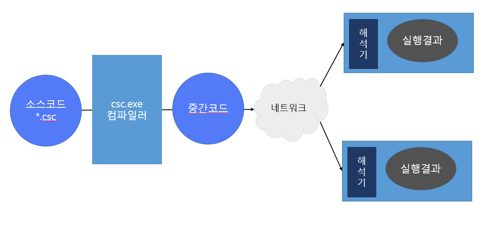
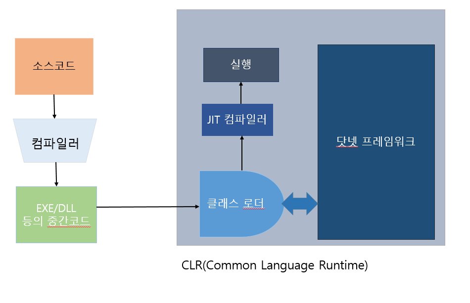

# 20191210

## Chapter01. C# 소개

### 닷넷 프레임워크

- 유비쿼터스에 대응하기 위한 마이크로소프트의 차세대 전략
- **유비쿼터스란?**
  - 모든 장치를 네트워크에 연결해 데이터를 주고받는 환경
  - 유비쿼터스 환경에서 사용되는 단말기는 다양한 플랫폼과 하드웨어로 구성됨
  - 이런 환경에서 사용되는 프로그램은 플랫폼 독립적이어야 함, 이식성 좋아야 함, 보안 기능이 뛰어나야 함, 대용량 저장장치(XML, DB)에 쉽게 액세스 가능해야 함, 웹과의 연동이 쉬워야  함
- 닷넷은 유비쿼터스 요구 조건을 충족하는 개발환경 
- 가상 머신 개념 사용 
- **가상머신이란?**
  - 운영체제, 다양한 API(CRL 형태로 제공됨)
- 닷넷은 자바와 유사한 개념을 많이 포함함
- 자바 프레임워크와는 다르게 20가지 이상의 다양한 언어를 지원함... 그러나 C#을 사용하는 것이 좋다고 한다~~
- 닷넷은 자바를 기본 모델로 사용해 만들었음 -> 자바 개념이 많이 녹아있음.

#### 윈도우 비스타와 닷넷 3.0

**윈도우 비스타**: MS-DOS -> 윈도우  -> 윈도우  XP 계보를 잇는 마이크로소프트의 차세대 32/64 비트 기반 개인용 

​                         운영체제

윈도우 비스타 출시 시점과 맞춰서 닷넷 3.0 버전이 출시

윈도우 비스타, 롱혼 서버부터는 운영체제의 일부로 포함됨 -> 중요성 강화

**마이크로소프트의 차세대 운영체제**

- Native: 비관리 코드 방식의 애플리케이션, Win32/64 를 기반으로 CPU가 사용하는 기계어로 프로그램 코드를 직접 번역해 사용하는 모델, SDK나 MFC 기반의 개발 방식
- Hybrid: Native+Managed 방식, 하나의 애플리케이션에서 관리, 비관리 코드를 동시에 사용하는 모델
- Managed: 닷넷 플랫폼 기반의 개발 방식

**닷넷 3.0 버전:** 닷넷 2.0 + WCF, WPF, WF, Windows CardSpace

**WinFX란?**

- WCF, WPF, WF, WCS를 통칭하는 용어

- 닷넷 프레임워크 상에서 작동하는 신규추가된 애플리케이션 개발 프레임워크

- WCF(Windows Comunication Foundation): 차세대 메시징 프레임워크

- **WPF(Windows Presentation Foundation)**: WinFX에서 지원하는 차세대 윈도우 UI 프레임워크

  윈도우 비스타 시대의 새로운 UI, XAML(eXtensible Application Markup Language)를 이용해서 개발과 디자인을 분리함 

  - 디자이너가 UI를 개발
  - 프로그래머가 이벤트를 추가함 
  - 2D, 3D, 그래픽, 애니메이션, 미디어, 문서 등을 다룰 수 있음
  - WPF는 기존 GDI, GDI++에서 제공한 API를 사용하지 않음, DirectX 기반의 MilCore를 사용 -> UI 요소를 직접 렌더링...(오호 신기...!)

- WF(Windows Workflow Foundation): XML 웹 서비스와 닷넷 리모팅에 대한 차세대 프레임워크

### 차세대 언어 C#

#### C# 언어는 왜 만들어졌나요?

- 원래 MS는 인터넷의 잠재성을 깨닫지 못했음(한창 윈도우에 인터넷 기능이 포함되어 있지 않았을 때...)

- 인터넷이 폭발적 성장(넷스케이프 웹 브라우저, 자바 애플릿, 자바 스크립트 등의 인터넷 관련 기술 등장-> 시장 확대) 해서 MS가 급하게 익스플로러와 비주얼 베이직을 변형한 비주얼 베이직 스크립트를 개발...(넘나 느렸습니다...)

- 시장 진입이 넘나 느렸던 MS는 선사가 개발한 자바를 임의로 변형해서 익스플로러에 탑재... & 자바 개발 툴이 없었던 시장 니즈에 맞추어 MS는 J++이라는 강력한 개발 툴 무료로 공급함... 

  -> SUN사와 MS의 법적분쟁 

  -> MS는 패했음...

  -> 자바를 변형해서 사용할 수 없게 된 MS

  -> 시대의 대세는 인터넷을 기반으로 하는 분산 네트워크 기술로 옮겨가기 시작...!

    MS가 자바를 가장 많이 사용하는 네트워크 언어로 만들었지만... 안타깝게도 자바를 사용할 수 없게 된 MS...    

   따흑...ㅠㅠ

  -> 핵심 기술로 자바가 확고한 위치 차지했고 IBM, 오라클 등 대형 IT에서 자바 중심으로 분산 네트워크 기술 구현을 시작했음...

  -> 이런 상황을 타개하기 위해 만든 MS의 기술이 .NET(닷넷)

- 닷넷 = 애플리케이션, 서비스가 유기적으로 통합되기 위한 MS의 제품군과 기술 환경 및 서비스

- 자바 기술에 대응하기 위해 MS가 새로운 차세대 인턴세 환경을 만듬

- JDK와 비슷한 라이브러리의 집합, 이 라이브러리를 가장 효율적으로 사용해 개발할 수 있는 언어로 C#을 만들어 발표

- 자바 대응 전략의 핵심 언어

- 비주얼 베이직의 생산성 + 비주얼 C++의 성능을 가짐

#### C# 언어는 어디에 사용되나요?

- 닷넷 프레임워크가 활성화되지 않음 -> 아직까지 많이 사용되고 있지 않은 미완의 프레임워크
- Java는 JVM 위에서 작동하듯, C#이 작동학기 위해서는 CLR 엔진과 닷넷 프레임워크가 필요함 

#### C#의 장점

- **분산 환경에 적합한 언어**

  ASP.NET(웹 관련 프로그램), XML.NET, 모바일 프로그램을 빠른 시간 안에 개발 가능

- **구조 중립적**

  다양한 환경의 운영체제에서 실행 가능

- **뛰어난 생산성**

  비주얼 베이직의 생산성+비주얼 C++의 성능 동시 제공 -> 개발 시간 단축

- **강력한 디버깅 기능**

### C# 작동원리

- 자바와 유사하게 컴파일 방식+인터프리터 방식인 하이브리드 방식을 사용함 
- 확장자가 csc로 끝나는 소스코드 작성
- csc.exe 컴파일러를 이용 -> 중간 코드 생성 
- C#의 중간코드는 EXE, DLL로 되어 있음, But... C/C++ 의 컴파일 언어가 생성한 EXE, DLL과는 다르다...!
  - C#의 중간코드는 닷넷 프레임워크가 설치된 환경에서만 작동, 아니라면 작동되지 않음....
  - 윈도우, 리눅스, 유닉스에서 사용가능한 해석기가 만들어져 있음. 

- 소스코드 컴파일 -> 중간코드는 CLR이용 -> 실행 파일로 변환됨 
- CLR은 자바의 JVM과 동일한 원리로 만들어짐 
- 윈도우 비스타 버전부터는 운영체제 안에 닷넷 프레임워크가 설치되어 있음.(나머지 버전에는 닷넷 프레임워크를 깔아야 실행 가능했다고 함...)
- 중간 코드를 클래스 로더가 읽음 -> JIT 컴파일러 이용 -> 실행 가능한 기계어 코드를 생성

