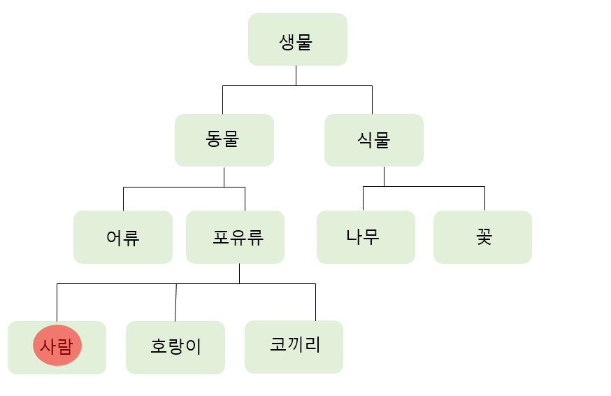
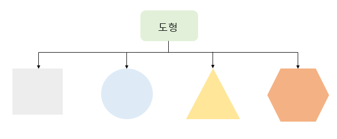

# 20191216

## Chapter04. 객체지향과 메서드

### 객체지향 개념
- 객체 지향 프로그래밍(OOP) 기법: 가장 주목받는 최신 프로그램 기법 중에 하나

#### 객체지향 개발 방법의 등장 배경
- 절차지향 개발 방식: 분석, 설계 , 프로그래밍 , 테스팅 등을 수행하면서 프로그램을 작성하는 방법
    - 함수를 중심으로 프로그램을 작성-> 구조적 프로그래밍 방법이라고 불림
    - 대량의 데이터를 함수로 나눠 순차적으로 처리할 때 적합한 프로그래밍 방식
    - 프로그램의 구성 요소를 모듈로 나눠 구조적으로 작성할 수 있는 큰 장점을 가짐
    - 프로그램의 규모가 커질수록 절차지향 기법을 이용한 개발방식은 효율성이 크게 떨어진다는 단점을 가짐
    - OS가 계속 새롭게 개발되고 있음 -> 더 이상 구조 지향 프로그램 기법으로는 이런 개발 속도를 따라잡을 수 없게 됨. 
    - 시대의 패러다임 변화로 인해 새롭게 객체지향 프로그래밍 기법이 등장함 

#### 객체지향 프로그래밍의 특징
- 구조지향 프로그래밍 기법: 커피, 캔 자판기를 따로 따로 운영하는 것
          vs
- 객체지향 프로그래밍 기법: 커피/캔 판매 기능이 통합된 자판기를 운영하는 것

**상속**


- 사람은 생물- 동물- 포유류를 상속받아 탄생함.
- 포유류의 입장: 사람, 호랑이, 코끼리는 같은 개체임
- 상속 관계: 자신을 기준으로 위에 있는 계층을 부모, 아래에 있는 계층을 자식 계층으로 구분 가능함.
- 사람을 표현한다면 c#코드로 표현이 가능함.

```C#
class 생물 {...}
class 동물 : 생물 {...}
class 포유류 : 동물 {...}
class 사람 : 포유류 {...}
```

**다형성**
- 절차지향 개발 방식: 기능이 필요할 떄마다 새로운 함수를 추가로 만들어야 함. 
    - 개발자는 다양한 함수의 기능과 매개변수, 반환값을 모두 암기하고 있어야함 -> 중복 없이 프로그램을 효율적으로 개발 가능
    - 함수의 개수가 많으면 일일히 관리하는 것도 상당히 어려움
-> 이런 경우 객체지향 기법을 활용하면 많은 이점 얻을 수 있음. 

- 다형성: 하나의 메서드에 여러 개의 함수를 묶어 표현하는 것(메서드 오버로딩)
- **오버로딩**: 
    - 동일 객체 안에서 함수 이름은 같지만 매개변수의 타입과 개수가 다른 것을 말함
    - 동일한 이름을 갖는 함수로 다양한 기능을 수행할 수 있는 장점을 가지게 됨
    ```C#
    public Box(int w, int h, int d){
        width=w;
        height=h;
        depth=d;
    }

    public Box(double w, double h, double d){
        dwidth=w;
        dheight=h;
        ddepth=d;
    }
    ```
- **오버라이딩**:
    - 상속관계에서 사용되는 용어
    - 오버로딩: 메서드 이름은 같지만 매개변수의 개수와 반환 값의 타입이 틀림
         vs
    - 오버라이딩: 함수 이름과 매개변수 개수와 반환타입이 완전히 일치함.
    ```C#
    class Aclass {
        int Box(int x, int y){
            return (x+y);
        }
    }

    Bclass  :Aclass{
        int Box(int x, int y){
            return (x-y);
        }
    }
    ```

**캡슐화**
- 내부의 상세화된 구조를 몰라도 인터페이스만 알고 있으면 해당 모듈을 사용할 수 있는 것
- 캡슐화: 객체에 데이터와 메서드 숨김, 인터페이스 통로를 통해 값을 입력하고 결과를 받는 것
- CPU에게 1과 10이라는 값을 넣어주고 더하기를 요구 시 11이라는 값이 반환됨 (내부 작동 모르지만 프로그래머 프로그램 작성에는 지장을 주지 않음)
- 프로그램 언어에서 캡슐화는 접근한정자를 이용해 쉽게 구현이 가능함.

- **캡슐화의 장단점**
    - 콘텍600에는 감기를 치료하는 데 필요한 각종 알갱이가 들어가있음 -> 먹기 쉽게 포장한 것이 콘텍600
    - 장점: 프로그램을 콘텍600처럼 캡슐 형태로 작성하면 사용자는 프로그램 내부의 구성을 신경쓰지 않아도 됨
      - 이식성과 호환성이 좋음
      - 객체를 모듈화해서 부품처럼 사용 가능
      - 객체 안에 포함된 정보의 손상과 잘못된 사용 방지 가능
    - 단점: 일반적인 경우에는 문제가 없짐나 특정 조건에서 심각한 문제 발생 가능성이 있음.
    

**추상화**


- 원은 도형이라는 추상적인 개념으로 표현 가능
- 추상화: 객체 지향 프로그램 언어에서 객체를 효현 시 유용하게 사용할 수 있는 개념
- 사각형, 원, 삼각형, 육각형의 공통점인 도형의 속성을 뽑아내 표현 가능
- 추상화 기법 사용 시 메모리를 효율적으로 사용 가능함.

#### 클래스
- 클래스: 객체의 개념을 표현하는 최소 실행 단위
    - 학급,반이라는 뜻을 가짐
    - 클래스는 학교를 구성하는 완전히 독립적인 하나의 개체
    - 객체의 개념을 가진 최소단위
    - 변수와 메서드의 집합으로 되어있음
    - `new` 키워드를 통해 메모리에 객체 `인스턴스`를 생성시켜줘야 함
- `인스턴스`: 클래스라는 형판을 메모리에 초기화시켜줌, 사용할 수 있는 형태로 만들어줌 

**C#의 메모리 구조**
- 메서드 영역: 클래스의 메서드에 대한 바이트 코드 또는 클래스 변수 등을 할당하는 메모리 영역
- 스택: 메서드가 실행될 때 매개변수, 메서드 내에 선언된 지역, 임시 변수들의 스택 메모리 영역에 저장됨 
    - 메서드 실행 종료 시 스택 메모리는 시스템에 반환됨
- 힙: C#에서 객체 사용 시 사용하는 중요한 메모리 공간
    - `new` 연산자 사용하여 인스턴스를 생성하는 메모리 공간
    - 클래스, 배열, 문자열 등의 객체 인스턴스가 저장됨

### 메서드
- 메서드: C#에서 특정 작업을 처리하는 최소한의 덩어리
- 보통 메서드 매개변수로 특정 값 입력 시 내부 연산을 통해 특정값을 반환함.

#### 메서드 기본 형태
```C#
[접근 한정자] [반환값 타입] 메서드이름([매개변수...])
{
    ...코드
    return 반환 값;
}
```
- 접근 한정자: public, private, protected
- 메서드 이름: 식별자 규칙에 맞게 작성
- 매개변수: 메서드에 입력하는 데이터 선언부
- return 문은 반환값이 void일 경우 제외하고 모두 반드시 메서드 구현부에 포함되어 있어야 함

```C#
 class MethodExam
    {
        static void Main()
        {
            int data;
            data = sample(10);
            System.Console.WriteLine("return data = {0}", data);
        }

        public static int sample(int x)
        {
            return (x * x);
        }
    }
```
- Main 메서드는 프로그램의 시작점을 알리는 메서드

  - [원형]

    ```C#
    public static void Main(string [] args){
            ...
    }
    ```
  -  접근 한정자가 public이지만 일반적으로 생략함
  - static: 전역 메서드라는 뜻
  - void: 반환 값이 없다는 뜻
  - Main: 프로그램의 시작점을 가리키며 괄호 안의 string [] args는 입력창에서 매개변수 값을 넘겨받을 떄 사용함
  - string [] args 커맨드는 입력창에서 매개변수 값을 넘겨받을 때 사용함
    - 커맨드에서 문자열 입력을 안 받는다면 이 부분은 생략함.    

#### 인수 전달 방법
**값에 의한 호출(call by value)**
- 인수로 전달한 변수와 호출된 메서드에서 사용하는 변수가 서로 다른 기억 공간을 사용함.
```C#
class CallbyValue
    {
        static void Main()
        {
            int x, y;
            x = 5;
            y = 10;
            Console.WriteLine("Main1(x, y)값 = ({0}, {1})", x, y);
            Swap(x, y);
            Console.WriteLine("Main2(x, y)값 = ({0}, {1})", x, y);
        }
        public static void Swap(int x, int y)
        {
            int temp = x;
            x = y;
            y = temp;
            Console.WriteLine("Swap(x, y) 값= ({0}, {1})", x, y);
        }
    }
```
- 결과
Main1(x, y)값 = (5, 10)
Swap(x, y) 값= (10, 5)
Main2(x, y)값 = (5, 10)
- **값에 의한 호출은 원본과 메서드 안에 있는 값이 서로 다른 메모리 공간 안에 할당됨** 
- -> 스왑 메서드 호출 후에도 x,y 값은 그대로 유지됨

**참조에 의한 호출(call by reference)**
- 인수로 전달한 변수와 호출된 메서드에서 사용하는 변수가 서로 같은 기억 공간을 사용함
- 참조에 의한 호출은 ref 또는 out 키워드를 사용함
- `ref` 키워드: 변수를 전달하기 전에 반드시 초기화함
- `out` 키워드: 호출되는 메서드의 반환 이전에 값을 할당해야 함
    - 이전 값을 모두 무시함
- ref, out 키워드는 메서드 정의와 호출하는 곳에 모두 사용해야 함
```C#
 class CallbyReference
    {
        static void Main()
        {
            int x, y;
            x = 5;
            y = 10;
            Console.WriteLine("Main1(x, y)값=({0},{1})", x, y);
            Swap1(ref x, ref y);
            Console.WriteLine("Main2(x, y)값=({0},{1})", x, y);
            Swap2(out x, out y);
            Console.WriteLine("Main3(x, y)값=({0},{1})", x, y);
            
        }

        public static void Swap1(ref int x, ref int y)
        {
            //이 함수를 호출 전에 초기화하므로 함수 부분에는 초기화 부분이 없다. 
            int temp = x;
            x = y;
            y = temp;
            Console.WriteLine("ref Swap(x, y) 값=({0},{1})", x, y);
        }
        public static void Swap2(out int x, out int y)
        {
            //out 형식이므로 여기서 x, y의 값을 할당
            x = 100;
            y = 200;
            Console.WriteLine("out Swap(x, y) 값=({0},{1})", x, y);

        }
    }
```
#### 가변 인수 다루기
- 보통 메서드의 인자는 고정된 길이가 많음
- But... 가변 인수 기법을 이용하면 임의의 매개변수를 메서드 인자로 넘길 수 있음
- `params` 키워드 이용하여 구현
- 메서드 선언부에 하나만 사용함

**가변 인수 사용 형식**
```C#
public int Month(params int [] args){
    ...
}

static void Main(){
    Month(31, 28,31,30,31,31,30,31,30,31);
}
```

```C#
class ParamExam
    {
        static void Main()
        {
            Month(31, 28, 31, 30, 31, 31, 30, 31, 30, 31);
        }
        public static void Month(params int[] args)
        {
            for(int i = 0; i < args.Length; i++)
            {
                Console.WriteLine("{0}월 = {1}일", i + 1, args[i]);
            }
        }
    }
```

- 만약 다양한 형식의 임의의 매개변수를 사용하려면 어떻게 할까? 
    - -> 이 때는 C#의 최상위 클래스인 Object를 이용하면 됨

**Object형 가변 인수 사용하기**

#### 재귀 메서드
#### 메서드 오버로딩
