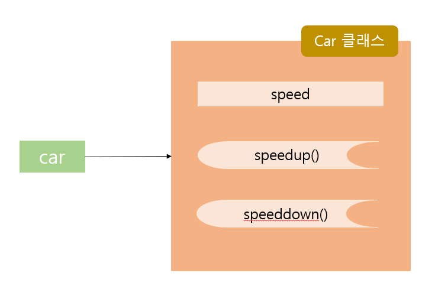

# 20191216

## Chapter05 클래스

### 클래스 구성 요소
- 클래스: 객체를 표현하는 기본 단위
```C#
[public/abstract/sealed] class 클래스명{
    ...//클래스 멤버
}
```
- []안에 있는 것은 생략이 가능함
    - public: public을 사용해 생성된 클래스는 모든 클래스에서 접근 가능
    - abstract: 추상 클래스를 선언할 때 사용
    - sealed: 종단 클래스(=C에서 final 선택항목을 가진 클래스와 의미가 같음)를 선언할 때 사용: 상속 불가
[클래스 선언1]
```C#
public class Car{
    public int speed;
    public void speedup(){
        speed++;
    }
    public void speeddown(){
        speed--;
    }
}
```
[클래스 선언2]-- 상속관련
```C#
abstract class Car{ //abstract Car 클래스 선언
    public int speed;
    abstract void speedup(); 
    abstract void speeddown();
}
```
[클래스 선언3]-- 상속관련
```C#
sealed class Car{ //sealed 클래스 선언(상속 불가능)
    public int speed;
    public void sppedup(){...}
    public void speeddown(){...}
}
```
[클래스 선언4]
```C#
class Car{ //Car 클래스에 한정자 없음
    public int speed;
    public void speedup(){...}
    public void speeddown(){...}
}
```
| 기능 정의           | 클래스 멤버 | 설명                                                         |
| ------------------- | ----------- | ------------------------------------------------------------ |
| 초기화/소멸         | 생성자      | 클래스 초기화와 관련된 기능 처리, 클래스명과 생성자 이름은 동일 |
|                     | 소멸자      | 클래스 이름에 ~를 붙인 메서드, 클래스가 소멸되는 시점에 호출됨 |
| 데이터 저장 및 처리 | 상수        | 상수는 변하지 않는 수, 읽기 전용 속성을 가짐                 |
|                     | 멤버 변수   | 필드라고도 불림. 접근 제한자와 static, readonly, const로 멤버 변수를 정의할 수 있음. |
|                     | 속성        | 프로퍼티라고도 불림. 클래스 외부에서는 멤버 변수처럼 보임. 속성은 스마트 필드라는 별칭을 가짐, get/set을 이용해서 설정함. |
|                     | 인덱서      | 접근자에 매개변수가 있는 것을 제외하면 프로퍼티와 유사, get/set을 이용해 설정하며 인덱서에 매개변수가 들어감 |
| 기능 구현           | 메서드      | 메서드 명명 규칙에 따라, 클래스가 수행하는 주요 기능을 구현함 |
| 기타                | 이벤트      | 이벤트 처리와 관련된 기능을 구현. delegate 와 event를 이용해 이벤트를 정의. |

- 클래스를 사용하기 위해서는 객체의 인스턴스를 가리키는 객체참조변수를 선언해야 함
- 인스턴스는 new 연산자를 이용해서 사용할 객체 정보를 메모리에 할당하는 작업을 함

```C#
클래스명 객체참조변수;
객체참조변수 = new 클래스 생성자명();
```

```C#
클래스명 객체참조변수 = new 클래스 생성자명();  [축약형]
```
- Car 클래스를 인스턴스 형태로 만들려면 이런 코드로 작성해야 함
```C#
Car car;
car = new Car();
```

```C#
Car car = new Car();
```
- car는 객체참조변수임
- 객체참조변수의 이름은 일반 변수의 명명규칙과 동일함.
- `car = new Car();`에서 Car 클래스의 생성자로 메모리의 힙 영역에 할당된 객체참조변수를 개체 인스턴스라고 부름

- 객체 선언: 객체 선언은 null 값을 가진 객체참조변수만을 선언한 것을 의미함.
```C#
 Car car; // 여기서 car은 null값을 가진 객체참조변수
```
- 객체 인스턴스 설정: 객체에 대한 메모리가 실제로 할당됨, 객체참조변수는 특정 메모리 주소를 참조 가능함.
```C#
 car = new Car();
```

- Car 클래스에 대한 car 인스턴스가 생성되면, 포인트 연산자를 이용해서 Car 클래스가 갖고 있는 public 속성 구성 요소에 접근 가능함.
```C#
 car.speed=10;
 car.speedup();
 car.speeddown();
```

```C#
   class Example
    {
        public int data; //멤버 변수
        public const double PI = 3.141517; //상수
        public Example()    //생성자
        {
            Console.WriteLine("Example 생성자");
            data = 10;
        }
        public void Display() //멤버 메서드
        {
            Console.WriteLine("클래스 메서드 호출");
        }
    }
    class ClassExample
    {
        static void Main(string[] args)
        {
            Example obj = new Example();  //인스턴스 생성
            Console.WriteLine("data = {0}, PI = {1}", obj.data, Example.PI);

            Console.WriteLine("Example 클래스 Display 메서드 호출");
            obj.Display();
        }
    }
```

```C#
[클래스명][객체참조변수] = new [클래스 생성자];
```

- obj(객체참조변수)는 포인트 연산자(.)를 이용해 Example 클래스의 public 속성에 접근이 가능
- 생성자는 객체 인스턴스가 생성되는 순간 실행됨

#### 생성자
- 생성자: 클래스명과 동일한 메서드
- 객체가 초기화될 때 가장 먼저 실행됨
- 보통 객체 초기화 작업에 사용됨
```C#
[객체참조변수] = new 클래스명()
```

**생성자 오버로딩**
- 중복 선언 가능 -> `생성자 오버로딩`이라고 부름
- 생성자는 객체변수의 인스턴스를 생성할 때 호출됨
- 컴파일러는 new 연산자 뒤에 기술된 생성자의 매개변수 개수와 타입을 확인 -> 해당 생성자를 호출함.

```C#
 class Example
    {
        public Example()
        {
            Console.WriteLine("생성자 1");
        }
        public Example(int data)
        {
            Console.WriteLine("생성자 2 : " + data);
        }
        public Example(string str)
        {
            Console.WriteLine("생성자 3 : " + str);
        }
        public Example(double a, float b)
        {
            Console.WriteLine("생성자 4 : " + (a + b));
        }
    }
    class ClassExam2
    {
        
        static void Main(string[] args)
        {
            Example obj1 = new Example();
            Example obj2 = new Example(10);
            Example obj3 = new Example("안녕하세요");
            Example obj4 = new Example(10.5, 10.5f);
        }
    }
```

**private 생성자**
- 생성자는 보통 public 접근 제한자를 사용함 <- 외부에서 클래스 초기화 부분에 접근할 수 없다면 클래스를 사용할 수 없어서...!
- 그러나 정적 클래스(static class)를 외부에서 사용할 때, 굳이 생성자의 초기화 작업을 공개할 필요 없음 -> private 생성자를 사용함.

#### 소멸자
- 클래스 인스턴스가 메모리에서 제거되기 직전에 호출됨
- 인스턴스 사용이 마무리되는 시점에 수행해야 할 코드를 실행함
- Main 메서드에서 ClassExam 클래스의 개체 인스턴스 obj를 생성해 사용하다가 obj 변수의 유효범위 벗어나면, C# 컴파일러는 ClassExam 클래스의 소멸자를 호출
- 명시적 호출이 아니라 컴파일러가 자동으로 인스턴스 변수 사용이 끝나면 호출함
- C#에서는 소멸자가 하는 역할을 System.IDisposable 인터페이스를 상속받은 Dispose 메서드가 대신하는 경우가 많음 
- Dispose 메서드는 C#에서 개체 인스턴스 작업을 마무리하는 용도로 사용됨
```C#
class ClassExam
    {
        public ClassExam()
        {
            Console.WriteLine("생성자");
        }
        ~ClassExam()
        {
            Console.WriteLine("소멸자");
        }
        public void Display()
        {
            Console.WriteLine("멤버 메서드 호출");
        }
    }
    class ClassExam3
    {
       
        static void Main()
        {
            ClassExam obj = new ClassExam();
            obj.Display();
        }
    }
```

#### 상수/읽기 전용 필드

#### 멤버 변수/멤버 메서드

#### 속성(Property)

#### 인덱서

#### 이벤트

### 접근 제한자

### 정적 변수 및 메서드(Static Variables and methods)

### 내포 클래스(Nested class)

### using과 this 키워드

### 사용자 정의 데이터형
