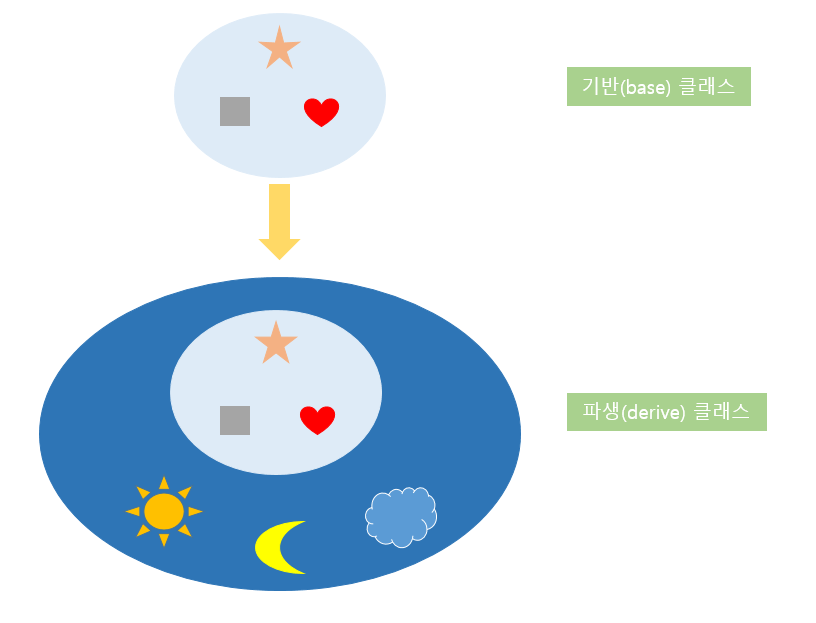
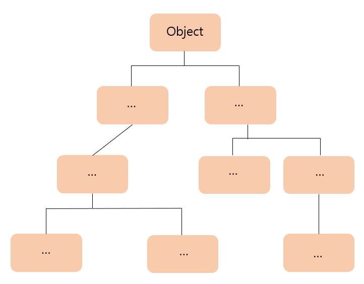
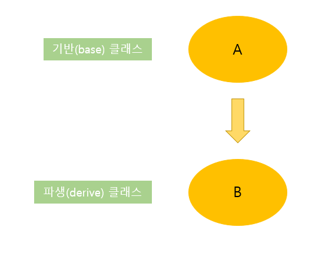

# 20191217

## Chapter06. 클래스 상속

### 상속이란

상속: 객체지향 프로그래밍에서 코드의 재사용성과 간결성을 제공하는 중요한 특징
- 상속개념 이용하여 기반 클래스 바탕으로 새로운 기능 추가 -> 파생 클래스 만듦
- 코드의 재활용 통해 빠른 속도로 프로그램 개발 가능
- 프로그램의 재사용성을 증대시키는 C#의 중요한 특징
- 기존 클래스: 기반 클래스(Base class), 또는 부모 클래스(Parent Class)라고 부름
- 파생 클래스: 기반 클래스를 확장하여 새롭게 정의한 클래스
    - 파생 클래스(Derive Class) 또는 자식 클래스(Child Class)라고 부름
- 파생 클래스는 기반 클래스의 public, protected 속성 및 기능을 모두 물려받음
- 상속: 파생 클래스가 기반 클래스의 속성 및 기능을 물려받아 재사용하는 것


- 기반 클래스에서 정의된 속성을 상속받은 클래스에서 사용 가능함.
- 기반 클래스의 속성을 파생 클래스에서 사용 시 public, protected 등의 접근 제한자가 사용됨
- 닷넷 프레임워크는 Object 클래스를 최상위 클래스로 정해놓음
- 많은 클래스가 이 클래스를 상속받는 계층 구조로 이루어짐



#### 상속구현
- 상속은 파생 클래스 이름 뒤에 ':'을 사용, 기반 클래스 이름을 기술해 구현함.
```C##
[public/ abstract/ sealed]class [파생 클래스이름]:[기반 클래스이름]
{
    //멤버
}
```
- 상속 관계에서 파생 클래스는 기반 클래스의 public, protected, internal, protected internal 접근 제한자를 갖는 모든 멤버들을 상속받음.


```C#
public class B : A
{
    ...
}
```
### 상속과 접근 한정자
- 상속 관계에 있는 파생 클래스는 기반 클래스의 public, protected, internal, protected internal 접근 한정자를 갖는 멤버에 접근 가능함.
- private 접근 한정자를 갖는 멤버들: 클래스 내부에서만 사용됨
- public 멤버들: 클래스 외부에서 사용 가능
- protected 멤버: 상속 관계에서는 public 처럼, 아닐 때는 private 처럼 사용됨

```C#
    class Father
    {
        protected string family_name = "김";
        private string name = "아무개1"; //Son 클래스에서는 참조 불가능
        private int age = 39; //Son 클래스에서는 참조 불가능
    }
    class Son: Father
    {
        private string name = "아무개2";
        private int age = 10;
        public void Info()
        {
            Console.WriteLine("이름은 {0} {1} 입니다.", family_name, name);
            Console.WriteLine("나이는 {0} 살 입니다.", age);
        }
    }

    class InheritanceExam1
    {
        static void Main(string[] args)
        {
            Son obj = new Son();
            obj.Info();
        }
    }
```

```C#
class A
    {
        public A()
        {
            Console.WriteLine("A클래스 생성자");
        }
        ~A()
        {
            Console.WriteLine("A클래스 소멸자");
        }
    }
    class B:A
    {
        public B()
        {
            Console.WriteLine("B클래스 생성자");
        }
        ~B()
        {
            Console.WriteLine("B클래스 소멸자");
        }

    }
    class C: B
    {
        public C()
        {
            Console.WriteLine("C클래스 생성자");
        }
        ~C()
        {
            Console.WriteLine("C클래스 소멸자");
        }
    }
    class InheritanceExam2
    {
        static void Main(string[] args)
        {
            C obj = new C();
        }
    }
```
[실행결과]
A클래스 생성자
B클래스 생성자
C클래스 생성자
C클래스 소멸자
B클래스 소멸자
A클래스 소멸자
- 클래스의 생성자와 소멸자도 상속됨
- 생성자는 메모리에 값이 초기화될 때 실행됨
- 소멸자는 메모리에서 객체가 제거되기 직전에 호출됨
- 생성자는 안쪽부터, 소멸자는 바깥쪽부터 실행됨
- A>>B>>C

### 오버라이드와 base 키워드
- 상속관계에서 파생 클래스는 기반 클래스의 멤버에 대해 오버라이드할 수 있음.
- new 키워드를 사용해 구현, new의 기능: 인스턴스를 생성할 때의 기능과는 다름

```c#
[접근제한자]new [반환형][메소드 이름]([매개변수]...)
[접근제한자]new [자료형][변수명]
```

### 추상 클래스와 추상 메서드
### virtual 키워드와 가상 메서드
### override 사용하기
### sealed 클래스와 sealed 메서드
### 인터페이스
