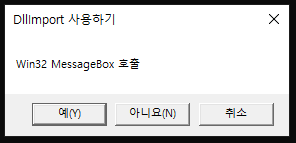

# 20191218

## Chapter7. 델리게이트, 이벤트, 어트리뷰트

### 델리게이트
- '델리게이트(delegate)': '위임' 또는 '대리자'로 번역됨
- C/C++에서 사용하는 함수 포인터와 동일한 개념
- 주로 이벤트와 관련된 처리에 사용됨
- C#에서 델리게이트는 메서드의 포인터를 저장할 뿐 내부에 코드를 기술하지 않음
- 델리게이트는 delegate 키워드를 사용해서 선언함
- 메소드를 마치 변수처럼 만들어주는 역할
- 메소드도 타입으로 사용이 가능함 

`public delegate [메서드이름];`

- 델리게이트는 호출할 메서드와 시그너처가 정확하게 일치해야 함
- 두 정수를 입력받아 그 값을 더해서 반환하는 Add() 메서드가 있다면

```C#
public int Add(int a, int b)
{
    return a+b;
}
```

-> 이 메서드의 호출을 대리할 델리게이트는 다음과 같은 형태가 되어야 함
```C#
delegate int AddDelegate(int a, int b);
```
- 델리게이트는 대리할 메서드와 이름은 달라도 되지만 반환형과 매개변수 타입 및 개수 등은 반드시 일치해야 함
- 델리게이트를 이용해 호출할 메서드가 정해져 있음.
```C#
 class Arithmetic
    {
        public int Add(int a, int b) { return a + b; }
        public int Sub(int a, int b) { return a - b; }
        public int Mul(int a, int b) { return a * b; }
        public int Div(int a, int b)
        {
            if ((a == 0) || (b == 0)) return 0;
            return a / b;
        }
        public void PrintInfo(string str)
        {
            System.Console.WriteLine("Arithmetic::PrintInfo = {0}", str);
        }
    }
    //메서드의 포인터를 저장할 뿐 내부에 코드 기술 안 함 
    //호출할 델리게이트 정의
    public delegate int ArithmeticDelegate(int a, int b);
    public delegate void PrintInfoDelegate(string str);

    class DelegateExam1
    {
          public static void Main()
        {
            //클래스 인스턴스 생성
            Arithmetic obj = new Arithmetic();
            //Add(int a, int b) 메서드 호출하기 위해서 사용
            ArithmeticDelegate ex1 = new ArithmeticDelegate(obj.Add);
            System.Console.WriteLine("Add: ex(20,10) = {0}", ex1(20, 10));
            ex1 = new ArithmeticDelegate(obj.Sub);
            //시그너처가 동일한 다른 메서드를 호출하고 싶다면
            //new 연산자 이용 -> 해당 메서드를 새로 지정해야 함.
            System.Console.WriteLine("Sub: ex(20,10) = {0}", ex1(20, 10));
            ex1 = new ArithmeticDelegate(obj.Mul);
            System.Console.WriteLine("Mul: ex(20, 10) = {0}", ex1(20, 10));
            ex1 = new ArithmeticDelegate(obj.Div);
            System.Console.WriteLine("Div: ex(20,10) = {0}", ex1(20, 10));

            PrintInfoDelegate ex2 = new PrintInfoDelegate(obj.PrintInfo);
            ex2("델리게이트 예제");
        }
    }
```
- PrintInfo 메서드를 델리게이트로 호출하고 싶다면 PrintInfo 메서드와 시그너처가 일치하는 PrintInfoDelegate 델리게이트를 사용해야 함

```C#
    class Example
    {
        public static void StaticMethod()
        {
            Console.WriteLine("Static 메서드");
        }

        public void NormalMethod()
        {
            Console.WriteLine("Normal 메서드");
        }
    }
    delegate void ExamDelegate();
    class DelegateExam2
    {
        static void Main(string[] args)
        {
            Example obj = new Example();
            ExamDelegate ex1 = new ExamDelegate(obj.NormalMethod);
            ExamDelegate ex2 = new ExamDelegate(Example.StaticMethod);
            ex1();
            ex2();
        }
    }
```
- static 형 메서드를 델리게이트로 접근 시 [클래스명.메서드명] 형태가 되어야 함 
  -> Example.StaticMethod 이용 

[실행결과]
Normal 메서드
Static 메서드

- static형 메서드를 델리게이트로 접근할 때 [클래스명.메서드명] 형태가 되어야 함
- Example 클래스의 인스턴스인 obj 통해 StaticMethod() 호출 시,
  정적 멤버는 인스턴스 참조를 사용해서 액세스할 수 없다는 컴파일 에러 메세지를 볼 수 있음.
- 하나의 델리게이트에 여러 개의 델리게이트를 등록 및 제거 가능함.
    - 델리게이트 등록 시: +=
    - 델리게이트 제거 시: -=

```C#
 class Example
    {
        public static void StaticMethod()
        {
            Console.WriteLine("Static 메서드");
        }
        public void NormalMethod()
        {
            Console.WriteLine("Normal 메서드");
        }
    }

    delegate void ExamDelegate();

    class DelegateExam3
    {
        static void Main(string[] args)
        {
            Example obj = new Example();
            ExamDelegate ex1 = new ExamDelegate(obj.NormalMethod);
            ExamDelegate ex2 = new ExamDelegate(Example.StaticMethod);
            ExamDelegate data;

            data = ex1;
            data();
            Console.WriteLine("=====================\n");
            data += ex2;
            data();
            Console.WriteLine("=====================\n");
            data -= ex1;
            data();
            Console.WriteLine("=====================\n"); 
        }
    }
```


### 이벤트 처리
- 이벤트: 특정 사건이 발생됐음을 알리는 메세지 
- 마우스 클릭, 키보드 누름 등 특정 사건 발생 시 운영체제나 해당 프로그램은 사건의 종류에 따라 특정 메세지를 발생
  -> 운영체제나 해당 프로그램은 사건의 종류에 따라 특정 메시지를 발생시킴.

- 발생된 메시지는 해당 애플리케이션에 전달되어 처리됨

```C#
public delegate void MyDelegate();
private event MyDelegate ExamEvent();
```

- 이벤트는 델리게이트 객체 선언에 event 키워드를 덧붙여 선언함
- 이벤트 정의했으면, += 및 -= 연산자 이용해서 이벤트 핸들러를 등록 및 제거 가능함.

```C#
ExampleClass obj = new ExampleClass();
ExamEvent += new MyDelegate(obj.Method);
```

- 이벤트 핸들러는 다음과 같이 정의함

```C#
public delegate void EventHandler(object sender, EventArgs args)
```
- object sender: 보통 호출한 객체를 가리키는 this가 사용됨
- EventArgs args: 이벤트 핸들러 파라미터

- sender: 이벤트를 보내는 객체
- args: 이벤트 핸들러가 사용하는 파라미터
- 이벤트 파라미터는 System.EventArgs 클래스를 상속받은 별도의 파라미터 객체에 의해 작성됨

**C# 이벤트를 만들어 사용하려면?**
1. 델리게이트를 만들거나 지정함
2. 다음을 포함한 클래스 만듦
  - 델리게이트에서 만든 이벤트
  - event 키워드를 사용하여 선언된 델리게이트의 인스턴스가 있는지 확인하는 메서드
  - 이벤트를 호출하는 메서드 
3. 메서드를 이벤트에 연결하는 클래스를 하나 이상 지정함
  - -+=및 -= 연산자를 사용해서 하나 이상의 메서드를 기본 클래스의 이벤트에 연결함
  - 이벤트에 연결되는 메서드의 정의
4. 다음과 같이 이벤트를 사용함
  - 이벤트 선언을 포함하는 클래스의 개체를 작성
  - 사용자가 정의한 생성자를 사용하여 이벤트의 정의가 포함된 클래스의 개체 작성


```C#
  class MyEventArgs : EventArgs
    {
        private int ClickCount;
        public MyEventArgs()
        {
            this.ClickCount = 0;
        }
        public MyEventArgs(int data)
        {
            this.ClickCount = data;
        }
        public int GetClickCount()
        {
            return this.ClickCount;
        }
    }
    class ExampleClass
    {
        public void OnClick(object sender, MyEventArgs args)
        {
            Console.WriteLine("{0} 개체에서 {1}번 이벤트가 발생했습니다.",
                sender.ToString(), args.GetClickCount());

        }
    }
    class EventExam1
    {
        public delegate void ClickEvent(object sender, MyEventArgs args);
        private event ClickEvent ExamEvent;

        public EventExam1()
        {
            ExampleClass obj = new ExampleClass();
            ExamEvent += new ClickEvent(obj.OnClick);
        }

        public void ClickMethod(int clickcount)
        {
            if (ExamEvent != null)
            {
                MyEventArgs args = new MyEventArgs(10);
                ExamEvent(this, args);
            }
        }
        public static void Main()
        {
            EventExam1 obj = new EventExam1();
            obj.ClickMethod(10);
        }
    }
```

[실행결과]
Chapter7.EventExam1 개체에서 10번 이벤트가 발생했습니다.

- EventArgs 클래스: 이벤트 데이터를 다루는 기본 클래스
- 이벤트를 통한 메세지 전달이 가능한 MyEventArgs 클래스를 만들고 싶다면 
  EventArgs 클래스를 상속받아야 함. 
- EventArgs 클래스를 상속받으면 MyEventArgs 클래스는 이벤트 데이터를 다루는 기본 기능을 갖추게 됨
- MyEventArgs 클래스는 두 개의 생성자와 변수 ClickCount 값을 반환하는 GetCickCount() 메서드가 정의되어 있음.

- void XXX(object sender, XXEventArgs args) 형태의 메서드를 포함한 ExampleClass클래스를 정의함

```C#
class ExampleClass
{
    public void OnClick(object sender, MyEventArgs args)
    {
        ... <Click 이벤트 발생시 처리할 내용 기술> ...
    }
}
```

- ExampleClass 클래스의 Onclick() 메서드를 가리키는 ClickEvent 델리게이트를 정의함
- sender: 이벤트를 발생시킨 개체 인스턴스
- args: 이벤트의 내용

```C#
public delegate void ClickEvent(object sender, MyEventArgs args);
```

- ExampleClass 클래스 OnClick() 메서드를 가리키는 ClickEvent 델리게이트 이용 
- -> ExamEvent를 정의함
- 이벤트 정의는 event 키워드를 사용

```C#
private event ClickEvent ExamEvent;
//[접근한정자]  event  [델리게이트]   [이벤트 이름];
```

- ExamEvent 이벤트 발생 시, ExampleClass의 OnClick() 메서드를 호출하도록 += 연산자 이용 -> 이벤트를 등록함
- 이벤트의 등록/제거는 델리게이트 등록/제거와 방법이 동일함.

```C#
ExampleClass obj = new ExampleClass();
ExamEvent += new ClickEvent(obj.OnClick);
```

- MyEventArgs 개체 이용해서 이벤트 내용을 채움
- 이벤트를 발생시킨 현재 개체(this) 정보와 같이 ExamEvent 이벤트를 호출함.

```C#
public void ClickMethod(int clickcount)
{
    if(ExamEvent != null)
    {
        MyEventArgs args = new MyEventArgs(10);
        ExamEvent(this, args);
    }
}
```

- 이벤트와 델리게이트의 차이점: 이벤트는 외부에서 직접 사용할 수 없음.
- 델리게이트는 콜백 용도로 사용, 이벤트는 객체 상태의 변화나 사건의 발생을 알리는 용도로 사용됨

### 어트리뷰트
- 어트리뷰트: 컴파일러와 구조체, 클래스 등에 영향을 미치는 범용적인 기능을 제공함.
             프로그램에 필요한 정보를 제공하는 기능
             컴파일타임과 런타임 모두 영향을 미침
             어트리뷰트 구문은 대괄호([])로 묶어서 표현함
```C#
[어트리뷰트명("positional_parameter", "named_parameter=value,...)]

[DllImport("User32.dll")]
[Obsolete("메세지를 호출합니다")]
[Conditional("Youngjin.com")]
```

- 어트리뷰트의 대괄호 안에는 지정위치, 이름 파라미터 및 명명 파라미터가 들어감
- 어트리뷰트의 정의 방식: 닷넷이 제공하는 내장 방식(Attribute 클래스를 상속받은 sealed 형태의 클래스), 사용자가 작성한 사용자 정의 방식

#### DllImport 어트리뷰트
- 윈도우 API 이용 시 주로 사용됨
```C#
 class AttributeExam1
    {
        [DllImport("User32.dll")]
        public static extern int MessageBox(int hWnd, string IpText, string IpCaption, int uType);
        
        static void Main(string[] args)
        {
            MessageBox(0, "Win32 MessageBox 호출", "DllImport 사용하기", 3);
        }
    }
```

- [실행결과]



- "User32.dll" 파일은 윈도우 OS가 제공하는 다양한 Win32 API를 가지고 있음

- DllImport 이용해서 "User32.dll"에 정의된 MessageBox 메서드의 프로토타입 정의하면 닷넷에서 윈도우 API를 호출 가능함.

- 윈도우 32 API 가 제공하는 MessageBox의 원형

  ```C#
  int MessageBox(HWNDhWnd, LPCTSTRlpText, LPCTSTRlpCaption, UINTuType);
  ```

  ```C#
  public static extern int MessageBox(int hWnd, string IpText, string IpCaption, int uType);
  ```

- 윈도우 API는 C형태로 제공됨 -> C#문법으로 MessageBox 프로토타입을 변경해서 사용해야 함

```C#
 MessageBox(0, "Win32 MessageBox 호출", "DllImport 사용하기",3);
```

#### Obsolete 어트리뷰트
- `Obsolete`: 폐물이 된, 쓸모없는 의 뜻
- Obsolete 어트리뷰트는 특정 메서드나 속성을 쓰지 말도록 유도함
- 프로그램 업그레이드 버전 사용 시 기존의 특정 기능 사용하지 못하게 경고하는 용도로 사용됨
