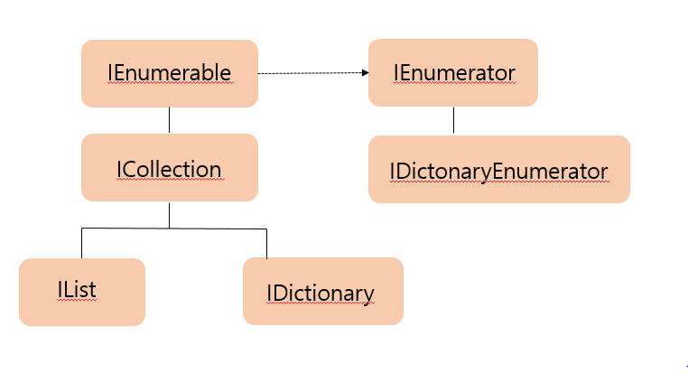

# 20191219

## Chapter08. 고급 프로그래밍 주제

### Section1. 문자열 클래스 다루기
#### String 클래스

- System.String 클래스는 문자열 처리와 관련된 다양한 메서드를 제공함.
- C#은 메서드를 이용해서 문자열을 다양한 형태로 가공 가능함.
- String 클래스는 System.Char의 순차적 집합 -> 유니코드 문자의 연속된 집합
- String에 들어간 문자열: 순차적인 컬렉션의 집합
    - 임의로 변경 불가능
- C#에서는 System.String 클래스의 사용빈도가 높음
- string이라는 별칭을 부여함 -> 기본 자료형처럼 사용함

**String 클래스 주요 메서드**

| 메서드      | 설명                                                    |
| ----------- | ------------------------------------------------------- |
| Compare     | 지역 설정을 바탕으로 입력된 문자열을 비교               |
| Format      | 문자열의 포맷을 지정해서 출력하는 static 메서드         |
| IndexOf     | 문자열의 앞머리부터 주어진 문자열을 찾아 위치를 반환    |
| LastIndexOf | 문자열의 뒤부터 주어진 문자열을 찾아 위치를 반환        |
| PadLeft     | 어떤 문자를 지정된 횟수만큼 반복해서 문자열의 앞에 추가 |
| PadRight    | 어떤 문자를 지정된 횟수만큼 반복해서 문자열의 뒤에 추가 |
| Replace     | 문자열 내의 특정 문자/문자열을 다른 문자/문자열로 교체  |
| Split       | 주어진 문자가 나타나는 곳을 찾아 토큰 문자 배열 생성    |
| SubString   | 문자열의 주어진 위치에서 시작하는 부분 문자열 반환      |
| ToLower     | 문자열을 소문자로 변경                                  |
| ToUpper     | 문자열을 대문자로 변경                                  |
| Trim        | 문자열의 시작 부분과 끝 부분에 포함된 공백을 제거       |


```C#
class StringExam1
    {
        static void Main()
        {
            System.String str = "Hello C#";
            str += "MagicSoft.pe.kr";

            System.Char ch = str[0];
            Console.WriteLine("str = {0} , ch = {1}", str, ch);

            for(int i = 0; i < str.Length; i++)
            {
                Console.Write(str[i]);
            }

            Console.WriteLine("\n str 문자열의 길이: {0}", str.Length);
            Console.WriteLine("str.IndexOf({0}) : {1}", "Magic", str.IndexOf("Magic"));

            str = null;

            for(int i = 2; i < 10; i++)
            {
                for(int j = 2; j < 10; j++)
                {
                    str += i + " * " + j + " = " + (i * j) + "\r\n";
                }
            }

            Console.WriteLine("****** 구구단 출력 ******");
            Console.WriteLine(str);
        }
    }
```

```C#
class StringExam2
    {
        static void Main()
        {
            string str = " 가나다라마바사 ";
            Console.WriteLine("[{0}]", str); //(공백)가나다라마바사(공백)
            Console.WriteLine("[{0}]", str.TrimStart()); //가나다라마바사(공백)
            Console.WriteLine("[{0}]", str.TrimEnd()); //(공백)가나다라마바사
            Console.WriteLine("[{0}]", str.Trim());//가나다라마바사
            Console.WriteLine("[{0}]", str.TrimStart().TrimEnd());//가나다라마바사
            Console.WriteLine("[{0}]", str.Insert(2, "ABC")); //(공백)ABC가나다라마바사

            Console.WriteLine("[{0}]", str + String.Concat("One", "Two", "하나", "둘")); // 가나다라마바사 OneTwo하나둘
            Console.WriteLine("[{0}]", str.Replace("나", "k")); //가k다라마바사

            Console.WriteLine("[{0}]", str.Replace("라마바", "MAGIC")); //(공백)가나다MAGIC사(공백)
            Console.WriteLine("[{0}]", str.Replace("나", "K").Replace("라마바", "MAGIC")); //가K다MAGIC사
            Console.WriteLine("[{0}]", String.Format("포맷 문자열 {0}*{1} = {2}", 10, 10, 10 * 10));
            //포맷 문자열 10*10=100
            Console.WriteLine("[{0}]", str.Remove(3, 3));
            // 가나바사 
            if (str.CompareTo(" 가나다라마바사 ") == 0)
                Console.WriteLine("같습니다.");
            else
                Console.WriteLine("같지 않습니다.");
        }
    }
```

- 실행결과
[ 가나다라마바사 ]
[가나다라마바사 ]
[ 가나다라마바사]
[가나다라마바사]
[가나다라마바사]
[ 가ABC나다라마바사 ]
[ 가나다라마바사 OneTwo하나둘]
[ 가k다라마바사 ]
[ 가나다MAGIC사 ]
[ 가K다MAGIC사 ]
[포맷 문자열 10*10 = 100]
[ 가나바사 ]
같습니다.

- String 클래스가 제공하는 TrimStart(), TrimEnd(), Trim() 메서드는 문자열에 포함된 공백을 제거함
- String 클래스의 Insert(), Concat(), Replace(), Remove() 메서드는 각각 문자열 삽입, 연결, 교체, 제거 등의 기능 수행
- String 클래스의 Format() 메서드는 서식 적용한 문자열 생성 시 유용하게 사용 가능함.

#### StringBuilder 클래스
- String 클래스 개체는 메모리에 크기가 한 번 설정되면 크기가 고정됨.
- 고정된 문자열 처리에 사용됨


```C#
string str = "안녕";
str = str+"하세요";
```


##### StringBuilder 클래스 주요 메서드

| 메서드     | 설명                                         |
| ---------- | -------------------------------------------- |
| Append()   | 현재 문자열에 문자열을 추가함.               |
| Insert()   | 현재 문자열 사이에 문자열을 추가함           |
| Remove()   | 문자를 현재 문자열에서 삭제함                |
| Replace()  | 문자열에서 특정 문자/문자열을 찾아 교체함    |
| ToString() | 문자열의 내용을 System.String 개체로 형 변환 |


##### String 클래스와 StringBuilder 클래스의 성능 차이 
```C#
 class StringExamm3
    {
        static void Main()
        {
            long start = DateTime.Now.Ticks;   //시작 시간 가져오기
            System.String str = null;          //str 문자열 선언

            for (int i = 0; i < 20000; i++)
            {
                str += "안녕하세요";
            }

            str = str.Replace('안', '만');      // 문자열에서 '안'자를 찾아서 '만'으로 교체 
            str = str.Remove(30, str.Length - 30);  // 앞에 30자만 남기고 삭제 

            long end = DateTime.Now.Ticks;   //종료 시간 가져오기

            Console.WriteLine("str 크기: {0}", str.Length);  //문자열 길이 출력
            Console.WriteLine("str 내용: {0}", str);         //문자열 내용 출력

            Console.WriteLine("소요 시간: {0}", end - start);   //소요시간 출력

            Console.ReadLine();
            
        }

    }
```
[실행결과]
str 크기: 30
str 내용: 만녕하세요만녕하세요만녕하세요만녕하세요만녕하세요만녕하세요
소요 시간: 2054508

- System.String을 사용함

```C#
 class StringExam4
    {
        static void Main()
        {
            long start = DateTime.Now.Ticks; //시작 시간 가져오기
            System.Text.StringBuilder str = new System.Text.StringBuilder();  //str 문자열 선언

            //"안녕하세요"를 20000번 더함
            for(int i=0; i < 20000; i++)
            {
                str.Append("안녕하세요");
            }

            str.Replace('안', '만');
            str.Remove(30, str.Length - 30);

            long end = DateTime.Now.Ticks;

        }
    }
```

[실행결과]
str 크기: 30
str 내용: 만녕하세요만녕하세요만녕하세요만녕하세요만녕하세요만녕하세요
소요 시간: 9970

- System.Text.StringBuilder를 사용함

```C#
     class StringExam5
    {
        static void Main()
        {
            //25 character정도의 공간을 잡는다.
            StringBuilder sb = new StringBuilder("www.youngjin.co.kr", 25);
            sb.Capacity = 20;

            Console.WriteLine(sb.ToString());
            Console.WriteLine("Capacity     :{0}", sb.Capacity);
            Console.WriteLine("MaxCapacity  :{0}", sb.MaxCapacity);
            Console.WriteLine("Length       :{0}", sb.Length);

            sb.Append(" 홈페이지"); .//StringBuilder 클래스 새엉 이후에 문자열 추가 시 사용함
            sb.AppendFormat("{0}{1}", "입니다.", "!"); //양식 문자열 설정 -> 특정 양식의 문자열을 추가 시 사용함
            Console.WriteLine(sb.ToString());
            Console.WriteLine("Capacity     :{0}", sb.Capacity);
            Console.WriteLine("Length       :{0}", sb.Length);

            sb.Replace("홈페이지", "사이트");  //문자열 내에서 첫번째 인자값을 두 번째 인자값으로 바꾸어줌
            sb.Insert(0, "http://");
            Console.WriteLine(sb.ToString()); //ToString을 통해 문자열로 변경됨, 이 시점부터 String 클래스의 멤버 메서드를 사용 가능함.
            Console.WriteLine(sb.ToString().ToUpper());

            sb.Remove(25, sb.Length - 25);
            Console.WriteLine(sb.ToString());


        }
    }
```
[실행결과]
www.youngjin.co.kr
Capacity     :20
MaxCapacity  :2147483647
Length       :18
www.youngjin.co.kr 홈페이지입니다.!
Capacity     :40
Length       :28
http://www.youngjin.co.kr 사이트입니다.!
HTTP://WWW.YOUNGJIN.CO.KR 사이트입니다.!
http://www.youngjin.co.kr

### 컬렉션 다루기
- 컬렉션: 객체를 저장하는 C# 라이브러리

- 객체를 다루는 일종의 배열

- |   배열   |   컬렉션     |
  | ---- | ---- |
  |  크기가 고정된 메모리 영역에서 동일한 데이터 다룸    |  크기가 동적으로 변하는 상태에서 이질적 데이터 다룸     |
  
- 컬렉션은 몇몇 인터페이스 사용 -> 통일성 갖추고 있음
- 닷넷은 통일성 기반으로 특정 알고리즘 수행에 최적화된 다양한 컬렉션 클래스를 제공함.

#### 컬렉션의 기본 인터페이스


- 대부분의 컬렉션은 IEnumerable과  ICollection 인터페이스를 상속받아 구현됨
- enumerable: '가산'이라는 뜻
- IList와 IDictionary인터페이스는 IEnumerable을 상속받은 ICollection 인터페이스에서 파생됨

#### IEnumerable와 IEnumerator 인터페이스
- IEnumerable 인터페이스를 상속받은 클래스는 GetEnumerator() 메서드를 재정의해야 함.
- GetEnumerator() 메서드의 반환 값을 통해 컬렉션에 포함된 객체에 접근 가능함.
```C#
public interface IEnumerable
{
    IEnumerator GetEnumerator();
}
```

- GetEnumerator()를 통해 Enumerator의 인스턴스 얻을 수 있음
- IEnumerator 인스턴스를 통해 컬렉션의 첫번째 요소부터 데이터를 순차적으로 추출 or 커서를 컬렉션의 첫번째 요소로 되돌릴수도 있음.

#### ICollection 인터페이스 멤버

| 속성    | 자료형 | 설명                        |
| ------- | ------ | --------------------------- |
| Current | Object | 컬렉션의 현재 요소를 가져옴 |

| 메서드          | 설명                                                         |
| --------------- | ------------------------------------------------------------ |
| bool MoveNext() | 열거자의 다음 요소로 이동한 경우 true 반환, 컬렉션의 끝을 지난 경우에는 false 반환 |
| void Reset()    | 컬렉션의 첫 번째 요소 앞으로 초기 위치를 돌림                |

```C#
    class EnumeratorExam
    {
        static void Main(string[] args)
        {
            int index = 0;
            string[] obj = { "빨", "주", "노", "초", "파", "남", "보" };

            IEnumerator e = obj.GetEnumerator();
            while (e.MoveNext())
            {
                Console.Write(" - {0}", e.Current);
            }
            Console.WriteLine();
            e.Reset();
            while (e.MoveNext())
            {
                if ((index % 2) == 1)
                    Console.Write(" - {0}", e.Current);
                index++;
            }
        }
    }
```
#### ICollection 인터페이스
- IEnumerable 인터페이스를 상속받은 ICollection 인터페이스는 컬렉션의 개체 수 정보를 확인하는 Count속성과 동기화 처리에 관련된 IsSynchronized 속성 제공함.

  **ICollection 인터페이스 속성**

  | 속성           | 자료형 | 설명                                                         |
  | -------------- | ------ | ------------------------------------------------------------ |
  | Count          | int    | 컬렉션의 개체 수 반환                                        |
  | IsSynchronized | bool   | 다중 스레드 환경에서 컬렉션에 대한 액세스를 동기화한 경우 true 반환 |
  | SyncRoot       | object | ICollection에 대한 액세스를 동기화하는 데 사용할 개체를 가져옴 |

```C#
ICollection myCollection = new ICollection();
lock(myCollection.SyncRoot)
{
    foreach(Object item in myCollection)
    {
        //처리할 작업
    }
}
```

#### IList 인터페이스
- IList 인터페이스는 ICollection 인터페이스에서 파생됨

- IList 인터페이스는 리스트 형식으로 인덱싱할 수 있는 기능을 제공

- 데이터 삽입, 삭제, 검색 등의 기능을 제공함.

- **IList 인터페이스 멤버**

  | 속성        | 자료형 | 설명                        |
  | ----------- | ------ | --------------------------- |
  | IsReadOnly  | bool   | 리스트가 읽기 전용인지 체크 |
  | IsFixedSize | bool   | 리스트가 고정 길이인지 체크 |

  | 메서드                               | 설명                                                        |
  | ------------------------------------ | ----------------------------------------------------------- |
  | int Add(object value)                | 리스트 끝에 데이터(value)를 추가                            |
  | void Clear()                         | 리스트의 모든 데이터(value)를 제거                          |
  | bool Contains(object value)          | 데이터가 리스트에 포함되었는지 여부를 확인                  |
  | int IndexOf(objct )                  | 리스트 내의 특정 데이터(value)의  위치(index)를 반환        |
  | void Insert(int idnex, object value) | 리스트 내의 특정 위치(index)에 데이터(value)를 삽입         |
  | void Remove(object value)            | 데이터(value)를 리스트에서 제거                             |
  | void RemoveAt(int index)             | 특정 위치(index)에 해당하는 데이터(value)를 리스트에서 제거 |

#### IDictionary와 IDictionaryEnumerator 클래스
- IDictionary 인터페이스는 ICollection에서 파생된 인터페이스로 키와 값을 쌍으로 다뤄 데이터를 검출함.

- 보통 사전에서 단어를 찾을 때, 알파벳을 기준으로 단어를 찾음 -> IDictionary 인터페이스도 이와 유사하게 데이터를 처리함

- IDictionary 인터페이스가 처리하는 데이터 값은 각각 고유한 키가 할당되어 있음.

- 사용자가 IDictionary 개체에 포함된 값을 찾고자 한다면, IDictionary 개체는 값마다 할당한 고유 키 값을 이용해서 사용자가 원하는 데이터를 즉시 반환함

- **IDictionary 인터페이스 멤버**

  | 속성        | 자료형      | 설명                                 |
  | ----------- | ----------- | ------------------------------------ |
  | IsReadOnly  | bool        | 컬렉션이 읽기 전용인지 체크          |
  | IsFixedSize | bool        | 컬렉션의 크기가 고정되어 있는지 체크 |
  | Keys        | ICollection | 컬렉션 내의 모든 키를 가져옴         |
  | Values      | ICollection | 컬렉션 내의 모든 값을 가져옴         |

  | 메서드                               | 설명                                                |
  | ------------------------------------ | --------------------------------------------------- |
  | int Add(object key, object value)    | 키와 값을 조합한 데이터를 컬렉션에 추가             |
  | void Clear()                         | 컬렉션의 모든 데이터를 제거                         |
  | bool Contains(object key)            | 특정 키가 컬렉션에 포함되었는지 확인                |
  | IDicionaryEnumerator GetEnumerator() | 키와 값을 갖는 IDicionaryEnuemrator 인터페이스 반환 |
  | void Remove(object key)              | 특정 키에 해당하는 데이터를 컬렉션에서 제거         |

- IDictionaryEnumerator 인터페이스는 IDictionary 인터페이스에 Enumerator 기능을 추가한 인터페이스

- IDictionaryEnumerator 인터페이스는 IDicionary에 포함된 데이터들에 대해 열거 기능을 제공함.

- **IDictionaryEnumerator 인터페이스 멤버**

  | 속성   | 자료형          | 설명                                                  |
  | ------ | --------------- | ----------------------------------------------------- |
  | Entry  | DictionaryEntry | 열거 요소내의 키와 값을 DictionaryEntry 형태로 가져옴 |
  | Keys   | object          | 열거 요소내의 키를 가져옴                             |
  | Values | object          | 열거 요소내의 데이터를 가져옴                         |

### ArrayList 클래스

- IList, ICollection, IEnumerable 인터페이스를 상속받음
- 객체 저장, 검색, 삭제 등의 기능을 제공하는 메서드를 포함함.
```C#
using System.Collections;

namespace Chapter7
{
    class ArrayListExam
    {
        static void Main(string[] args)
        {
            ArrayList obj = new ArrayList();    //ArrayList 객체 생성
            obj.Add("안녕하세요");              //문자열 정보 추가
            obj.Add(1000);
            obj.Add(DateTime.Now);

            foreach (Object data in obj)
            {
                Console.WriteLine("{0}", data);
            }

            int index = obj.IndexOf(1000);
            Console.WriteLine("숫자 1000 위치는 {0} 입니다.", index);

            obj.Insert(1, 10.5);
            Console.WriteLine("\n\n 데이터 추가 후 ArrayList 출력\n");
            foreach(Object data in obj)
            {
                Console.WriteLine("{0}", data);
            }
        }
    }
}
```
[실행결과]
안녕하세요
1000
2019-12-20 오후 12:33:24
숫자 1000 위치는 1 입니다.


 데이터 추가 후 ArrayList 출력

안녕하세요
10.5
1000
2019-12-20 오후 12:33:24

- ArrayList 클래스는 Add() 메서드를 사용함 -> 다양한 데이터를 추가하고 관리 가능함.
```C#
public virtual int Add(Object value)
```

- Add() 메서드는 ArrayList의 끝부분에 추가함. 반환 값은 추가된 객체의 인덱스 번호
```C#
ArrayList obj = new ArrayList();
obj.Add("안녕하세요");
obj.Add(1000);
obj.Add(DateTime.Now);
```

- ArrayList에 포함된 정보는 foreach를 이용해 내용을 확인 가능함.
```C#
foreach(Object data in obj){
    Console.WriteLine("{0}", data);
}
```

- IndexOf() 메서드는 Object 값을 찾아 인덱스 위치를 반환함 
- IndexOf() 메서드가 반환하는 인덱스는 0부터 시작하며, 일치하는 Object를 못 찾으면 IndexOf() 메서드는 -1을 반환함


### SortedList와 Hashtable클래스

### 큐(Queue) 클래스
### 스택(Stack) 클래스


