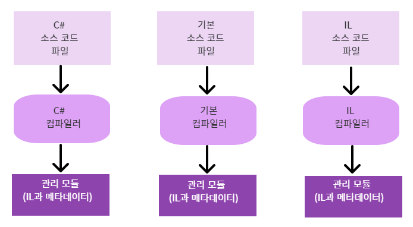

# Chapter01. CLR의 실행모델
- 이 장의 목표:
    - .NET Framework는 어떻게 설계되었는가
    - .NET Framework가 포함하는 기술들
    - .NET Framework 용어들
    - 작성한 코드를 하나 이상의 클래스나 구조체 등의 타입을 포함하는 응용프로그램이나 재배포가 가능한 구성요소로 만드는 과정
    - 만든 응용프로그램이 어떻게 실행되는지 

## 소스코드를 관리 모듈로 컴파일하기
- 어떤 종류의 응용프로그램이나 구성요소를 만들 것인지 구상해야 함

- 어떤 프로그래밍 언어를 사용하여 프로그램을 만들 것인지 결정할 차례

- 각각의 언어들은 서로 다른 가능성과 장점을 가지고 있으므로 선택하기 쉽지 않음

- 예시: 비관리(Unmanaged) C/C++의 경우 상당히 낮은 수준(row-level)까지 시스템 제어 가능
  
    - 메모리를 어떤 방식으로 사용하고 관리할 것이지를 세밀하게 관리 가능, 필요에 따라 쓰레드 만들 수 있음, 이 외에도 여러 가지가 있음
    
- 예시: Visual Basic 6.0의 경우, 사용자가 UI를 쉽고 빠르게 만들 수 있도록 도움을 주고 COM(Component Object Model) 객체와 데이터베이스에 대한 제어를 간단하게 처리가능하게 함

- 공용 언어 런타임(Common Language Runtime, CLR)은 서로 다른 프로그래밍 언어들 사이에서 공동으로 사용 가능한 실행환경(Runtime)임
    - CLR의 핵심 기능들: 메모리 관리, 어셈블리 로딩, 보안, 예외 처리, 스레드 동기화 등
    - 이 기능들은 CLR을 지원하는 어떤 프로그래밍 언어라도 제약없이 자유롭게 사용 가능함
    - 실행 시점에서 발생한 오류를 보고하기 위해 예외를 사용하면 CLR을 지원하는 프로그래밍 언어라면 예외처리를 통해 오류가 발생했다는 사실을 알 수 있음
    - 공용 언어 런타임이 개발자에게 스레드 프로그래밍 기능을 제공하므로 공용 언어 런타임을 지원하는 어떤 프로그래밍 언어에서든지 스레드를 만들 수 있음
    - 그러나 실행 시점에 CLR은 개발자가 소스코드를 작성할 떄 어떤 프로그래밍 언어를 사용하였는지 알 수 있는 방법은 없음
    - 가장 잘 표현 가능한 프로그래밍 언어를 택하여 사용하기만 하면 됨
    - 컴파일러가 CLR 환경에서 코드가 작동가능하도록 컴파일할 수 있기만 하면 코드를 어떤 프로그래밍 언어에서라도 개발 가능함
    
- 근데 선택한 프로그래밍 언어를 다른 프로그램이 언어와 함께 쓸 수 있다는 것이 왜 좋을까?

- 컴파일러: 프로그래밍 언어의 문법에 따라 코드의 옳고 그름을 판단해주는 도구
    - 소스 코드 검사, 확인, 의도를 표현하는 코드 만들 것
    - 서로 다른 프로그래밍 언어를 통해 다채로운 문법을 사용하여 개발하는 것이 의외로 개발자에게 큰 이점을 주기도 함

- 

- 소스 코드 파일은 다음과 같은 과정을 거쳐 컴파일이 됨

- CLR을 지원하는 프로그래밍 언어라면 원하는 대로 소스코드 작성이 가능함

- 해당 언어를 지원하는 컴파일러를 사용하여 문법을 점검하고 소스 코드를 분석하게 됨

- 어떤 컴파일러를 사용하든 최종적으로 **관리 모듈**을 결과물로 얻게 됨

- 관리 모듈을 32비트 Windows용 표준 이식 가능 파일 또는 64 비트 Windows용 표준 PE 파일로 실행하기 위해서는 CLR이 필요함

- 관리 어셈블리는 Windows 환경에서 항상 데이터 실행 방지(Data Execution Prevention, DEP)와 임의 기준 주소(Address Space Layout Randomization, ASLR) 기술의 이점 누릴 수 있음

- 이 두 기술을 통해 시스템 전반에 대한 보안 강화 가능함

- [관리 모듈 내의 각 영역]

    - | 영역                 | 설명                                                         |
        | -------------------- | ------------------------------------------------------------ |
        | PE32 또는 PE32+ 헤더 | 표준 Windows PE 파일 헤더이며 공용 객체 파일 형식 헤더와 유사함  이 부분이 PE32타입을 사용하고 있다면 이 파일은 32비트 또는 64 비트 버전의 Windows에서 모두 실행 가능 이 부분이 PE32+ 형식을 사용한다면 이 파일을 실행하기 위해 64 비트 버전의 Windows가 필요함 이 헤더는 응용프로그램의 타입 구분 가능, GUI, CUI, DLL의 여부를 구분하고 언제 파일이 작성되었는지 시간 정보도 포함하고 있음 IL 코드만을 포함하는 모듈의 경우, PE32 및 PE32+ 헤더의 정보들은 무시됨. 네이티브 CPU 코드를 포함하는 모듈의 경우 네이티브 CPU 코드에 관한 정보가 헤더에 포함됨 |
        | CLR 헤더             | 이 모듈이 관리 모듈로 취급되기 위해서 필요한 정보(CLR과 유틸리티에 의해 해석된)들이 포함됨 이 헤더 안에는 필요로 하는 CLR의 버전과 몇 가지 플래그, 관리 모듈의 진입점 메서드(Main 메서드)의 MethodDef 메타데이터 토큰, 모듈 내의 메타데이터, 리소스, 강력한 이름, 그 외 기타 플래그와 정보들이 모듈 내의 어느 위치에 존재하는지, 각 블록 크기에 대한 정보가 포함됨 |
        | 메타데이터           | 관리 모듈에는 메타 데이터 테이블이 들어있음 테이블은 크게 두 종류가 있음 - 소스 코드 안에 들어있는 타입들과 멤버들의 선언을 서술하는 테이블 - 소스코드가 참조하는 타입들과 멤버들에 대해 서술하는 테이블 |
        | IL 코드              | 소스코드를 컴파일하여 만든 코드, 실행 시에 CLR은 IL 코드를 다시 네이티브 CPU 명령어로 컴파일하게 됨 |

        
## 공용 언어 런타임 로딩
- Windows가 EXE 파일의 헤더에 들어있는 정보에 따라 32비트 또는 64 비트 프로세스를 만들지 여부를 결정하면 Windows는 x86, x64, ARM 버전의 MSCORE.DLL 파일을 프로세스상의 주소 공간에 로드함
- X86이나 ARM 버전의 Windows에서는 32비트 버전의 MSCORE.DLL 파일이 %SYSTEMROOT%\SYSTEM32 디렉터리에서 찾을 수 있음
- X64 버전의 MSCORE.DLL 파일은 %SYSTEMROOT%\SYSTEM64 디렉터리에서 X64 버전의 MSCORE.DLL 파일은 %SYSTEMROOT%\SYSTEM32 디렉터리에서 찾을 수 있음
- 이런 매커니즘을 택하는 것은 이전 버전과의 호환성에 관련된 이유 때문임
- 그 다음, 프로세스의 주 스레드가 MSCORE.DLL 안에 정의된 메서드를 호출
- 이 메서드는 CLR을 초기화, EXE 어셈블리를 불러들이고, 어셈블리 안의 진입점(Entry Point) 메서드 호출을 시도함
- 이 시점에서 관리 응용프로그램이 실행됨

- 비관리 응용프로그램에서 Win32의 LoadLibrary 함수를 사용해서 관리 어셈블리를 로드하려고 하면 Windows는 이를 알아차리고 CLR이 로드되지 않은 경우 CLR을 로드해서 어셈블리 안에 들어있는 코드를 처리하기 위한 준비를 함
- 이 시나리오에서 프로세스는 이미 실행 중이고 이런 방식으로 사용하면 어셈블리의 활용성에 제한받게 됨

## 어셈블리 코드 실행하기
- 거의 모든 고급 언어들은 CLR이 제공하는 기능 중 일부만을 포장해서 제공해줌
- 그러나 IL 어셈블리 언어는 개발자들에게 CLR의 모든 기능들을 다룰 수 있게 해줌

- CLR이 어떤 기능을 제공하는지에 대해 알 수 있는 유일한 방법: CLR에 대한 명세서를 직접 읽는 것

- 메서드를 실행하기 위해 IL은 네이티브 CPU 명령어로 변환됨
- 이 작업이 CLR의 JIT(Just in time) 컴파일러에 의해 실행됨

- Main 메서드가 실행되기 바로 직전에 CLR은 Main 메서드 안에서 참조된 모든 타입들을 알아냄
- 이 과정에서 CLR이 내부적인 자료 구조를 하나 할당하도록 만듬
- 이것을 사용해서 참조된 타입에 대해 접근을 관리하는 용도로 사용하게 됨
- 각 Entry에는 각각의 메서드들에 대한 실제 코드가 메모리 주소상의 어느 위치에서 찾을 수 있는지 그 주소값을 보관함
- 이 자료구조를 초기화할 때, CLR은 각 항목들에 대해 문서화되지 않은 CLR 자신의 특정 함수를 가리키도록 설정하게 됨
- 여기서 우리는 이 함수를 JITCompiler라고 부르겠음

- 호출 발생 시, JITCompiler 함수는 어떤 메서드가 호출될 지, 어떤 타입에서 메서드가 정의되었는지를 알고 있음
- JITCompiler는 그 후 IL 코드 검사, 네이티브 CPU 명령어로 컴파일하는 과정 실행
- 네이티브 CPU 명령어는 메모리상에 동적할당된 메모리 블록에 저장함
- JITCompiler는 CLR에 의해 만들어진 타입 내부의 자료구조 안의 메서드 항목으로 돌아가서 방금 컴파일해서 네이티브 CPUㅁ ㅕㅇ령어를 저장한 메모리 블록 주소로 메모리 참조 주소를 바꿈 
- 마지막으로 JITCompiler는 해당 메모리 블록으로 점프해서 실제 코드를 수행함

- 성능 저하(Performance Hit)은 메서드가 최초로 호출될 때만 발생함
- 그 이후 발생하는 모든 후속 메소드 호출들은 네이티브 코드로서 빠른 속도로 실행됨
- 이유: 네이티브 코드에 대해서는 다시 내용을 검사하거나 컴파일할 필요 없기 때문임

- JIT 컴파일러는 네이티브 CPU 명령어를 동적 메모리상에 저장함
- 이 내용은 컴파일된 코드가 응용프로그램이 종료되는 시점에 자동 소거됨
- 만약 응용 프로그램을 나중에 다시 실행하거나 동시에 두 개 이상의 인스턴스를 실행하는 경우 JIT 컴파일러는 IL을 다시 네이티브 명령어로 캄파일하는 작업을 반복하게 됨
- 응용 프로그램에 따라서는 이런 방법으로 점유하는 메모리의 양을 읽기 전용의 코드 페이지를 실행 중인 프로그램 내의 모든 인스턴스에서 공유하는 네이티브 응용 프로그램보다 더 많이 사용하게 될 수도 있음

- 대부분의 응용프로그램들의 경우, JIT 과정에 발생하는 성능 저하는 크게 문제가 안 됨
- 이유: 대부분의 응용프로그램들은 같은 메소드를 반복적으로 사용하기 때문
- 이런 메서드들은 응용 프로그램이 실행되는 동안 단 한번 성능 저하를 일으킴

### IL과 검증 
- IL은 스택 기반의 언어임
- IL은 명령 종류에 무관함 
    - 더하기 명령어를 실행할 때, 스택에 들어있는 오퍼랜드의 종류를 확인하고 적절한 연산을 실행함
- IL의 가장 큰 장점: 응용 프로그램의 견고함과 보안을 이루게 해준다는 것
    - IL을 네이티브 CPU 명령어로 컴파일하는 동안, CLR은 **확인** 과정을 거치게 됨
    - 확인을 통해 높은 수준의 IL 코드를 검사, 모든 코드가 안전하게 작동할 수 있는지 점검함
- Windows에서는 각 프로세스가 고유의 가상 주소 공간을 가짐
    - 분리하는 이유: 응용 프로그램의 코드를 신뢰할 수 없기 때문임
    - Windows 프로세스들을 서로 분리된 주소 공간에 배치함 -> 견고함과 안정성을 얻을 수 있음, 어떤 프로세스가 역으로 다른 프로세스에 영향을 줄 수 없게 함
    - 관리 응용 프로그램을 Windows 단일 주소 공간 체계에서 여러 개를 실행하도록 할 수 있음

- Windows 상의 프로세스들은 기본적으로 많은 양의 시스템 자원들을 필요로 함
    - 성능에 영향을 끼칠 수 있고 사용 가능한 리소스에 제약을 받을 수 있음
- 관리 코드가 비관리 코드에 비해 가지는 장점: 하나의 OS 프로세스 내에서 여러 관리 응용프로그램을 실행 -> 프로세스의 숫자를 줄임
    - 적은 리소스 사용
    - 각자의 프로세스를 사용할 떄와 같은 견고함을 줌

- CLR이 이런 일들을 해줌   
    - 여러 관리 응용프로그램들을 단일 운영체제 시스템 프로세스 안에서 실행할 수 있는 기능 제공
- 각각의 응용 프로그램들은 앱도메인 안에서 실행됨
    - 기본적으로 각각의 관리 실행 파일들은 각자 분리된 주소에서 실행되고 하나의 앱도메인을 가짐

### 안전하지 않은 코드
- 기본적으로 마이크로소프트의 C# 컴파일러는 안전한 코드를 만들지만 개발자들이 안전하지 않은 코드를 작성하는 것도 허용함
- 안전하지 않은 코드를 이용해서 직접 메모리 주소 제어 가능, 특정 주소에 데이터를 쓸 수도 있음
- 이 기능은 매우 강력한 기능임, 비관리 코드와 상호 운용을 형성하거나 실행 속도에 민감한 알고리즘의 성능을 향상시킬 떄 매우 유용함

- 그러나 위험함...  
    - 데이터 구조를 훼손 가능
    - 시스템 공격 
    - 보안 취약점 만들 수 있음
- C# 컴파일러는 그래서... 안전하지 않은 코드를 포함하는 메서드 선언에 반드시 unsafe 키워드를 추가하도록 강제하고 있음

- MS는 PEVERIFY.EXE라는 유틸리티를 제공
    - 어셈블리 안의 메서드들이 안전하지 않은 코드들을 포함하는지 확인해줌
    - 이 도구로 참조하려는 어셈블리를 검사하는 것을 고려 가능
    - 이를 통해 응용프로그램이 인트라넷이나 인터넷상에서 실행하는데 문제가 있을 가능성을 미리 알려줌

- CLR의 확인 과정: 종속 관계에 있는 모든 메타데이터에 대한 접근을 필요로 함
- PEVERIFY 도구로 어셈블리를 검사할 때는 참조 가능한 모든 어셈블리를 찾아서 로드할 수 있도록 해줘야 함
- PEVERIFY 도구가 CLR을 통해 종속 관계에 있는 어셈블리들을 찾음 
- -> 어셈블리를 실행하기 위해 보통 사용하는 바인딩과 검색 규칙을 동일하게 사용함

## 네이티브 코드 생성 도구: NGEN.EXE

## 프레임워크 클래스 라이브러리

## 공용 타입 시스템

## 공용 언어 사양

## 비관리 코드와의 상호 운용성

