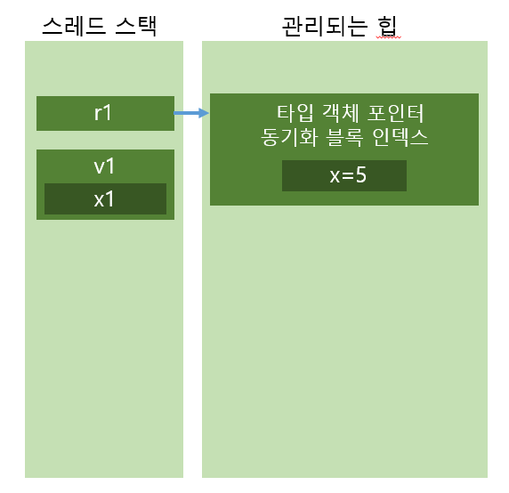
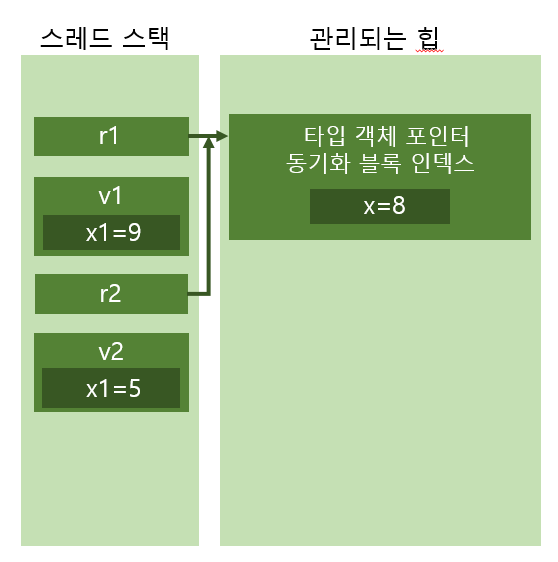

# Chapter05. 기본, 참조, 값 타입🦁
## 프로그래밍 언어의 기본 타입
- 일부 데이터 타입들은 일반적이고 당연함 -> 많은 컴파일러들이 코드를 작성하는 동안 단순화된 문법의 형태로 이를 사용가능하도록 지원함
```C#
  System.Int32 a = new System.Int32;
```
- 그러나 정수형 변수를 선언, 초기화 위해 이처럼 하는 것은 번거로움...
- 다행히 C# 포함한 많은 컴파일러들은 단순한 문법 사용해서 쉽게 이 작업을 끝날 수 있게 함
```C#
  int a= 0;
```
- 처음의 문장과 의미가 동일한 IL 코드 만들어줌
- **기본 타입:** 컴파일러가 직접 지원하는 데이터 타입들
    - 프레임워크 클래스 라이브러리 상에 정의된 타입들과 직접 연결됨
    - 예: int 타입은 System.Int32 타입과 바로 연결됨
```C#
 int          a = 0;                 //가장 쓰기 쉬운 문법
 System.Int32 a = 0;                 //비교적 쉬움
 int          a = new int();         //불편함
 System.Int32 a = new System.Int32;  // 명시적이지만 너무 돌아가는 문법
```

| 기본타입 | FCL 타입       | CLS 호환 | 설명                                                         |
| -------- | -------------- | -------- | ------------------------------------------------------------ |
| sbyte    | System.SByte   | 아니오   | 부호 있는 8비트 정수값                                       |
| byte     | System.Byte    | 예       | 부호 없는 8비트 정수값                                       |
| short    | System.Int16   | 예       | 부호 있는 16비트 정수값                                      |
| ushort   | System.UInt16  | 아니오   | 부호 없는 16비트 정수값                                      |
| int      | System.Int32   | 예       | 부호 있는 32비트 정수값                                      |
| uint     | System.UInt32  | 아니오   | 부호 없는 32비트 정수값                                      |
| long     | System.Int64   | 예       | 부호 있는 64비트 정수값                                      |
| ulong    | System.UInt64  | 아니오   | 부호 없는 64비트 정수값                                      |
| char     | System.Char    | 예       | 16비트 유니코드 문자(char 타입은 비관리 C++에서 사용하던 8비트 값 포함하지 않음) |
| float    | System.Singloe | 예       | IEEE 32비트 부동 소숫값                                      |
| double   | System.Double  | 예       | IEEE 64비트 부동 소숫값                                      |
| bool     | System.Boolean | 예       | 참/거짓 논리 값                                              |
| decimal  | System.Decimal | 예       | 128비트 고해상도 부동 소수값이며 금융 관련 연산 위해 정의된 타입, 반올림 관련 오류 묵과되지 않음. 128비트 중 1비트는 부호 표기, 96비트는 값 자체를 표현, 8비트는 10의 지수 승을 표현, 앞의 96비트의 값을 나누기 위해 사용, 나머지 비트는 여유 공간으로 남김. 지수는 0~28 사이의값 |
| string   | System.String  | 예       | 문자의 배열                                                  |
| object   | System.Object  | 예       | 모든 타입들의 기본 타입                                      |
| dynamic  | System.Object  | 예       | 공용 언어 런타임 관점에서는 dynamic 키워드 자체는 object 타입과 동일하게 취급됨. 그러나 C# 컴파일러에서 dynamic 타입은 동적 코드를 처리하기 위한 단순화된 문법의 일부로 취급됨. |
- C# 컴파일러는 소스코드에 다음과 같은 using을 이용한 별칭 정의를 자동으로 삽입함
```C#
  using sbyte = System.SByte;
  using byte = System.Byte;
  using short = System.Int16;
  using ushort = System.UInt16;
  using int = System.Int32;
  using uint = System.UInt32;
```
- 컴파일러는 다음의 예시에서 설명하는 타입들에 대해 암묵적이든 명시적이든 형 변환이 가능하도록 해줌
```C#
  Int32  i = 5;         // Int32에서 Int32로 암묵적 타입 변환 
  Int64  l = i;         // Int32에서 Int64로 암묵적 타입 변환
  Single s = i;         // Int32에서 Single로 암묵적 타입 변환
  Byte   b = (Byte) i;  // Int32에서 Byte로 명시적 타입 변환
  Int16  v = (Int16) s; // Int32에서 Int16로 명시적 타입 변환
```
- C#은 암묵적 타입 변환을 "안전하다"고 판단하는 타입 변환 연산에 대해서만 허용
  - Int32에서 Int64로의 변환과 같이 타입 변환과정에서 데이터 손실이 없다고 판단할 때만 적용됨
  - 그러나 잠재적으로 데이터 손실 가능성이 우려되는 타입 변환 연산에 대해서는 명시적인 타입 변환 허용

- 컴파일러의 종류에 따라서 이런 타입 변환 코드가 다르게 구현될 수 있음
- Single 타입의 6.8을 Int32 타입으로 변환할 때, 어떤 컴파일러는 Int32 타입으로 변환하면서 숫자 값 6을, 또 다른 컴파일러는 반올림을 적용하여 숫자 값 7을 넣어줄 수 있음
- C#의 경우에는 반올림이 아닌 버림을 적용 -> 숫자 값 6을 넣어주게 됨
- 기본 타입은 변수가 아닌 리터럴 상수로 기재 가능
  - 리터럴 상수는 타입에 대한 인스턴스 그 자체로 취급 가능, 멤버 호출 가능
- 리터럴 상수로 구성되는 표현식이 있다면 컴파일러가 해당되는 표현식을 컴파일 타임에서 평가해서 응용프로그램의 성능을 향상시키도록 할 수 있음
```C#
  Boolean found = false;    //found 변수의 값을 false로 설정함
  Int32 x = 100 + 20 +3;    //x 변수의 값을 123으로 설정함
  String s = "a "+"bc";     //s 변수에 들어갈 문자열로 "a bc"를 설정함
```
- 컴파일러는 연산자가 하나 이상 사용되었을 때 어떤 것의 우선순위를 높게 잡아서 처리해야 하는지에 대한 사항을 자동으로 해석, 처리해줌
```C#
  Int32 x = 100;                    //대입 연산자
  Int32 y = x+23;                   // 덧셈 연산자 수행 후 대입 연산자 수행
  Boolean lessThanFifty = (y < 50); // 보다 작음 비교 후 대입 연산자 수행
```

### 기본 타입 연산의 오버플로우 여부 검사
- 개발자들은 수학적 연산에서 오버플로우 발생할 가능성에 대해 주의 기울임
```C#
 Byte b = 100;    
 b = (Byte) (b+200);  // b에는 44(또는 0x2C) 값이 들어감
```
- 대부분의 프로그래밍 시나리오에서 이런 암묵적인 오버플로우는 예기치 않은 것, 정확하게 감지해서 처리해야 오동작이 없다
- 해시 값이나 체크 섬을 계산하는 경우 제외하고 대부분의 경우 오버플로우에 대한 검사는 필수적!

- C와 C++의 경우 오버플로우를 오류로 생각하지 않음, 오버플로우로 값이 변경되는 것 허용, 프로그램의 실행을 끊지 않음
- 그러나... Visual Basic .NET의 경우, 오버플로우도 명백한 오류로 취급함, 발견될 경우, 이 사실을 알리고 프로그램의 실행을 중단함
- CLR은 IL 명령어를 통해 컴파일러가 이에 대한 동작을 직접 선택할 수 있도록 하고 있음
- CLR은 두 개의 값을 더하는 add라는 명령 제공
- add 명령은 오버플로우에 대한 검사 수행 안 함

- add.ovf 라는 명령을 이용해서 두 값을 더하도록 지시 가능
- 이 명령어를 사용하면서 오버플로우가 발생하면 앞의 경우와는 다르게 System.OverflowException 예외 발생
- 뺄셈은 sub와 sub.ovf, 곱셈은 mul과 mul.ovf, 타입 변환은 conv와 conv.ovf 라는 IL 명령어를 제공해서 오버플로우를 검사하지 않는 경우와 검사하는 경우를 나누어 연산을 제공함

- C#은 개발자가 오버플로우를 어떻게 처리할 것인지 직접 선택할 수 있게 함
- 오버플로우에 대한 검사는 사용하지 않게 되어있음
- 컴파일러가 IL 코드를 만들면서 add, subtract, multiply, conv IL 명령을 사용해서 오버플로우에 대한 검사 없이 곧바로 연산 수행
- => 코드가 좀 더 빨리 실행되지만 개발자들이 오버플로우가 발생하지 않게 잘 설계하고 오버플로우에 대한 대응을 고려해야 함

- C# 컴파일러가 오버플로우 검사를 수행할 수 있도록 IL 코드를 만드려면 컴파일러 스위치 중 /checked+ 를 지정해야 함
- 이 스위치는 컴파일러가 오버플로우 여부를 검사하는 버전의 add, subtract, multiply, conv IL 명령으로 컴파일하도록 만듦
- 이렇게 컴파일된 코드는 조금 더 느리게 작동하지만 오버플로우가 발생하는 경우를 세심하게 검사함
- 오버플로우가 발생하는 경우, System.OverflowException 예외를 발생시킴

- 전역적으로 오버플로우 검사를 켜거나 끄는 것 외에도 개발자가 지역적으로 특정 코드 영역에서만 오버플로우 검사를 끄거나 켜는 방법도 사용 가능함
- C#에서는 checked와 unchecked 연산자를 사용하여 이를 유연하게 지원하고 있음

`UInt32 invalid = unchcked((UInt32) (-1));  //이상 없음`
- checked 연산자는 다음과 같이 사용됨

```C#
Byte b = 100;
b = checked((Byte) (b+200));  //OverflowException이 발생함
```
- 32비트로 값 변환해서 연산 -> 300을 Byte 타입으로 명시적으로 전환하면서 OverflowException 발생
- checked 연산자 밖에서 진행했다면 이 예외 발생하지 않았을 것
```C#
b = (Byte) checked(B+200);   //b contains 44; OverflowException 없이 실행됨
```
- checked 블록, unchecked 코드 블록을 만드는 것도 가능함

## 참조 타입과 값 타입
- 프레임워크 클래스 라이브러리상의 거의 대다수의 타입들은 모두 참조 타입, 개발자들이 자주 사용하는 값 타입이 그 나머지임
- 참조타입 -> 관리되는 힙에 항상 할당됨
- C# 의 new 연산자가 만들어진 객체의 주소를 반환함

- 참조타입을 사용할 때의 유념할 사항들
  - 메모리는 반드시 관리되는 힙에 할당되어야 함
  - 힙에 할당되는 각 객체들은 코드상에 선언된 사항들 이외에 추가적 멤버들을 포함하고 있으며 이들에 대한 초기화가 반드시 이루어지게 됨

- 값 타입은 기본적으로 하나 이상의 인터페이스를 구현할 수 있도록 해줌
- 모든 값 타입들은 봉인된 타입으로 다른 타입의 기본 타입이 될 수 없음
```C#
 // 참조 타입(클래스로 선언되어 있기 때문에)
class SomeRef { public Int32 x; }

// 값 타입(구조체로 선언되어 있기 때문에)
struct SomeVal { public Int32 x; }

static void ValueTypeDemo()
{
  SomeRef r1 = new SomeRef();     // 힙에 할당된다
  SomeVal v1 = new SomeVal();     // 스택에 할당된다
  r1.x = 5;                       // 포인터 역참조 발생
  v1.x = 5;                       // 스택에서 변경됨
  Console.WriteLine(r1.x);        // 숫자 "5"를 표시함
  Console.WriteLine(v1.x);        // 마찬가지로 "5"를 표시함
}
```
- 이 코드의 결과


```C#
// 참조 타입(클래스로 선언되어 있기 때문에)
class SomeRef { public Int32 x; }

// 값 타입(구조체로 선언되어 있기 때문에)
struct SomeVal { public Int32 x; }

static void ValueTypeDemo()
{
  SomeRef r1 = new SomeRef();     // 힙에 할당된다
  SomeVal v1 = new SomeVal();     // 스택에 할당된다
  r1.x = 5;                       // 포인터 역참조 발생
  v1.x = 5;                       // 스택에서 변경됨
  Console.WriteLine(r1.x);        // 숫자 "5"를 표시함
  Console.WriteLine(v1.x);        // 마찬가지로 "5"를 표시함

  SomeRef r2 = r1;                // 참조(포인터)만을 복사함
  SomeVal v2 = v1;                // 스택에 메모리 공간을 할당하고 모든 필드를 복사함
  r1.x = 8;
  v1.x = 9;
  Console.WriteLine(r1.x);        // 8
  Console.WriteLine(r2.x);        // 8
  Console.WriteLine(v1.x);        // 9
  Console.WriteLine(v2.x);        // 5
}
```
- 이 코드의 결과

- new로 생성했을 때는 할당되면서 초기화되지만 그냥 쓸 때는 값이 초기화되지 않는다.
- 값 타입의 주요한 이점: 관리되는 힙에 할당되는 객체가 아님
- 값 타입과 참조 타입의 다른 점들:
  - 값 타입 역시 참조 타입과 비교했을 때 한계가 있음
  - 참조 타입은 항상 박싱된 형태임
  - 값 타입은 System.ValueType 타입으로부터 항상 상속됨
    - 이 타입은 System.Object 타입과 동일한 기본 메서드들을 제공함
    - 그러나 System.ValueType 타입은 Equals 메서드를 재정의 -> 두 객체의 필드 값이 일치할 때 true 반환하도록 기능이 변경됨
    - System.ValueType 타입은 GetHashCode 메서드도 수정하는 데 만드는 해쉬코드의 값이 객체의 인스턴스 필드의 값을 활용하는 알고리즘을 사용하여 만들어지도록 수정됨
  - 기본 버전의 성능상의 문제로 새로운 값 타입 정의 시, 반드시 Equals와 GetHashCode 메서드에 대해 명시적으로 재정의해야 함
- 값 타입을 기본 타입으로 사용하여 새로운 값 타입이나 참조 타입을 정의할 수 없음 -> 값 타입에서 가상 함수 만들 수 없음 & 추상메서드 X, 암묵적으로 재정의 불가능!
- 참조 타입의 변수는 객체의 메모리 주소가 힙을 가리키도록 되어 있음
  - 기본적으로 참조 타입의 변수가 만들어지면 null로 초기화됨, 그래서 할당 안 하고 참조하면 NullReferenceException이 발생
  vs
  - 값 타입의 변수는 처음에 0으로 초기화되므로 NullReferenceException 발생 안 함
  - CLR이 null 형태가 가능한 변수에 대해서 nullable타입을 지정할 수 있도록 기능 제공
- 값 타입 변수를 다른 값 타입 변수로 대입시키려고 할 때, 하나씩 복제가 이루어짐 vs 참조 타입의 경우 메모리 주소만 복사
- 값 타입의 변수들은 서로 구분된 객체들이며 상호간에 영향을 주는 것은 불가능함
- 값 타입이 박싱되지 않은 상태로 할당되면 힙에 할당되지 않고 메서드와 함께 선언되고 할당됨 
  - -> 메서드의 실행이 끝나자마자 즉시 메모리가 할당 해지됨, 참조 타입이 가비지 컬렉터를 만날 때까지 기다리는 것과는 대조적임
## 박싱된 값 타입과 박싱되지 않은 값 타입
- 값 타입은 참조 타입보다 가벼움 <- 관리되는 힙에 객체로 할당되지 않기 때문!
- 가비지 컬렉터가 관리하지 않으며 포인터로 지칭되지 않음
- 그러나 값 타입에 대한 참조를 얻어야만 하는 일이 자주 있음
  - 값 타입 변수 내용을 ArrayList같은 곳에 담아 넣을 때 그러함.
  - 값 타입이 참조타입으로 변환되는 과정이 필요함 => '박싱'이라고 함
- 박싱이 일어나면서 진행되는 일들
  - 1. 관리되는 힙에 메모리가 할당됨
  - 2. 값 타입의 필드들은 새로 할당된 힙 메모리에 복사됨
  - 3. 객체의 메모리 주소가 반환됨

- **언박싱**: 
  - 박싱 작업에 비해 훨씬 적은 연산 수행
  - 박싱된 객체 안에 들어있는 원래의 값의 포인터를 얻어오는 것
  - 박싱된 인스턴스 안에 언박싱된 부분의 포인터를 가져오는 효과가 있음
  - 메모리 복사를 수반하지 않음
  - 언박싱 연산이 이루어진 다음 필드를 복사하는 작업이 이루어짐

- 박싱 & 언박싱/복사 작업 -> 응용프로그램의 속도와 메모리 소비 면에서 모두 성능 저하 일어남
- => 컴파일러가 이런 작업에 적게 의존하도록 코드 작성하는 것이 필요함

- 내부적으로 박싱된 값 타입 인스턴스를 언박싱하는 과정
- 1. 어떤 변수에 박싱된 값 타입의 인스턴스의 참조가 null로 설정되어 있으면 NullReferenceException이 발생함
- 2. 참조가 원하는 타입에 대한 박싱 객체를 가리키지 않는 경우, InvalidCastException 예외가 발생함

```C#
public static void Main()
{
    Int32 x = 5;
    Object o = x;               //x를 박싱하여 o에 객체 참조를 대입
    Int16 y = (Int16) o;        //InvalidCastException 예외가 발생
}
```
- 기대한 것과는 다른 동작...
- 논리적으로 문제가 없으나... 객체를 언박싱할 때, 이 경우에는 Int32 타입으로 정확하게 지정해줘야 함

- [수정 코드]
```C#
public static void Main()
{
    Int32 x = 5;
    Object o = x;                 //x를 박싱하여 o에 객체 참조를 대입
    Int16 y = (Int16)(Int32) o;   //우선 언박싱하고 정확한 타입으로 다시 캐스팅
}
```

- [언박싱과 복사가 같이 이루어지는 경우]
```C#
public static void Main()
{
    Point p;
    p.x = p.y = 1;
    Object o = p;       // p를 박싱하여 o에 객체 참조를 대입한다
    p = (Point)  o;       // o를 언박싱하고 박싱된 인스턴스 내의 모든 필드를 스택 변수상으로 복사해 넣음
}
```
- 마지막 줄에서 C# 컴파일러가 박싱된 인스턴스에 대한 주소를 갖고 있는 o를 언박싱 -> 필드의 시작 주소 얻어옴
- 필드의 모든 데이터를 스택 변수 p의 메모리 공간으로 복사하는 IL 코드를 자동으로 생성함

## 객체 해시 코드

## dynamic 기본 타입
