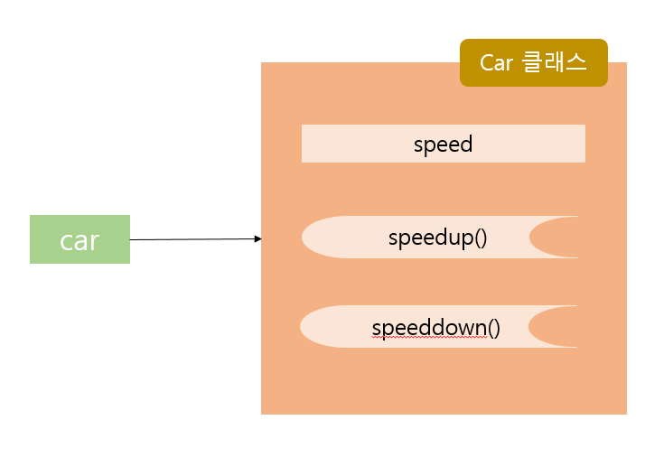

# 20191216

## Chapter05 클래스

### 클래스 구성 요소
- 클래스: 객체를 표현하는 기본 단위
```C#
[public/abstract/sealed] class 클래스명{
    ...//클래스 멤버
}
```
- []안에 있는 것은 생략이 가능함
    - public: public을 사용해 생성된 클래스는 모든 클래스에서 접근 가능
    - abstract: 추상 클래스를 선언할 때 사용
    - sealed: 종단 클래스(=C에서 final 선택항목을 가진 클래스와 의미가 같음)를 선언할 때 사용: 상속 불가
[클래스 선언1]
```C#
public class Car{
    public int speed;
    public void speedup(){
        speed++;
    }
    public void speeddown(){
        speed--;
    }
}
```
[클래스 선언2]-- 상속관련
```C#
abstract class Car{ //abstract Car 클래스 선언
    public int speed;
    abstract void speedup(); 
    abstract void speeddown();
}
```
[클래스 선언3]-- 상속관련
```C#
sealed class Car{ //sealed 클래스 선언(상속 불가능)
    public int speed;
    public void sppedup(){...}
    public void speeddown(){...}
}
```
[클래스 선언4]

```C#
class Car{ //Car 클래스에 한정자 없음
    public int speed;
    public void speedup(){...}
    public void speeddown(){...}
}
```
| 기능 정의           | 클래스 멤버 | 설명                                                         |
| ------------------- | ----------- | ------------------------------------------------------------ |
| 초기화/소멸         | 생성자      | 클래스 초기화와 관련된 기능 처리, 클래스명과 생성자 이름은 동일 |
|                     | 소멸자      | 클래스 이름에 ~를 붙인 메서드, 클래스가 소멸되는 시점에 호출됨 |
| 데이터 저장 및 처리 | 상수        | 상수는 변하지 않는 수, 읽기 전용 속성을 가짐                 |
|                     | 멤버 변수   | 필드라고도 불림. 접근 제한자와 static, readonly, const로 멤버 변수를 정의할 수 있음. |
|                     | 속성        | 프로퍼티라고도 불림. 클래스 외부에서는 멤버 변수처럼 보임. 속성은 스마트 필드라는 별칭을 가짐, get/set을 이용해서 설정함. |
|                     | 인덱서      | 접근자에 매개변수가 있는 것을 제외하면 프로퍼티와 유사, get/set을 이용해 설정하며 인덱서에 매개변수가 들어감 |
| 기능 구현           | 메서드      | 메서드 명명 규칙에 따라, 클래스가 수행하는 주요 기능을 구현함 |
| 기타                | 이벤트      | 이벤트 처리와 관련된 기능을 구현. delegate 와 event를 이용해 이벤트를 정의. |

- 클래스를 사용하기 위해서는 객체의 인스턴스를 가리키는 객체참조변수를 선언해야 함
- 인스턴스는 new 연산자를 이용해서 사용할 객체 정보를 메모리에 할당하는 작업을 함

```C#
클래스명 객체참조변수;
객체참조변수 = new 클래스 생성자명();
```

```C#
클래스명 객체참조변수 = new 클래스 생성자명();  [축약형]
```
- Car 클래스를 인스턴스 형태로 만들려면 이런 코드로 작성해야 함
```C#
Car car;
car = new Car();
```

```C#
Car car = new Car();
```
- car는 객체참조변수임
- 객체참조변수의 이름은 일반 변수의 명명규칙과 동일함.
- `car = new Car();`에서 Car 클래스의 생성자로 메모리의 힙 영역에 할당된 객체참조변수를 개체 인스턴스라고 부름

- 객체 선언: 객체 선언은 null 값을 가진 객체참조변수만을 선언한 것을 의미함.
```C#
 Car car; // 여기서 car은 null값을 가진 객체참조변수
```
- 객체 인스턴스 설정: 객체에 대한 메모리가 실제로 할당됨, 객체참조변수는 특정 메모리 주소를 참조 가능함.
```C#
 car = new Car();
```

- Car 클래스에 대한 car 인스턴스가 생성되면, 포인트 연산자를 이용해서 Car 클래스가 갖고 있는 public 속성 구성 요소에 접근 가능함.
```C#
 car.speed=10;
 car.speedup();
 car.speeddown();
```

```C#
   class Example
    {
        public int data; //멤버 변수
        public const double PI = 3.141517; //상수
        public Example()    //생성자
        {
            Console.WriteLine("Example 생성자");
            data = 10;
        }
        public void Display() //멤버 메서드
        {
            Console.WriteLine("클래스 메서드 호출");
        }
    }
    class ClassExample
    {
        static void Main(string[] args)
        {
            Example obj = new Example();  //인스턴스 생성
            Console.WriteLine("data = {0}, PI = {1}", obj.data, Example.PI);

            Console.WriteLine("Example 클래스 Display 메서드 호출");
            obj.Display();
        }
    }
```

```C#
[클래스명][객체참조변수] = new [클래스 생성자];
```

- obj(객체참조변수)는 포인트 연산자(.)를 이용해 Example 클래스의 public 속성에 접근이 가능
- 생성자는 객체 인스턴스가 생성되는 순간 실행됨

#### 생성자
- 생성자: 클래스명과 동일한 메서드
- 객체가 초기화될 때 가장 먼저 실행됨
- 보통 객체 초기화 작업에 사용됨
```C#
[객체참조변수] = new 클래스명()
```

**생성자 오버로딩**
- 중복 선언 가능 -> `생성자 오버로딩`이라고 부름
- 생성자는 객체변수의 인스턴스를 생성할 때 호출됨
- 컴파일러는 new 연산자 뒤에 기술된 생성자의 매개변수 개수와 타입을 확인 -> 해당 생성자를 호출함.

```C#
 class Example
    {
        public Example()
        {
            Console.WriteLine("생성자 1");
        }
        public Example(int data)
        {
            Console.WriteLine("생성자 2 : " + data);
        }
        public Example(string str)
        {
            Console.WriteLine("생성자 3 : " + str);
        }
        public Example(double a, float b)
        {
            Console.WriteLine("생성자 4 : " + (a + b));
        }
    }
    class ClassExam2
    {
        
        static void Main(string[] args)
        {
            Example obj1 = new Example();
            Example obj2 = new Example(10);
            Example obj3 = new Example("안녕하세요");
            Example obj4 = new Example(10.5, 10.5f);
        }
    }
```

**private 생성자**
- 생성자는 보통 public 접근 제한자를 사용함 <- 외부에서 클래스 초기화 부분에 접근할 수 없다면 클래스를 사용할 수 없어서...!
- 그러나 정적 클래스(static class)를 외부에서 사용할 때, 굳이 생성자의 초기화 작업을 공개할 필요 없음 -> private 생성자를 사용함.

#### 소멸자
- 클래스 인스턴스가 메모리에서 제거되기 직전에 호출됨
- 인스턴스 사용이 마무리되는 시점에 수행해야 할 코드를 실행함
- Main 메서드에서 ClassExam 클래스의 개체 인스턴스 obj를 생성해 사용하다가 obj 변수의 유효범위 벗어나면, C# 컴파일러는 ClassExam 클래스의 소멸자를 호출
- 명시적 호출이 아니라 컴파일러가 자동으로 인스턴스 변수 사용이 끝나면 호출함
- C#에서는 소멸자가 하는 역할을 System.IDisposable 인터페이스를 상속받은 Dispose 메서드가 대신하는 경우가 많음 
- Dispose 메서드는 C#에서 개체 인스턴스 작업을 마무리하는 용도로 사용됨
```C#
class ClassExam
    {
        public ClassExam()
        {
            Console.WriteLine("생성자");
        }
        ~ClassExam()
        {
            Console.WriteLine("소멸자");
        }
        public void Display()
        {
            Console.WriteLine("멤버 메서드 호출");
        }
    }
    class ClassExam3
    {
       
        static void Main()
        {
            ClassExam obj = new ClassExam();
            obj.Display();
        }
    }
```

#### 상수/읽기 전용 필드
- 상수를 선언할 때, public 키워드 사용 시, 외부에서 [클래스명.상수]형태로 접근 가능
- 상수는 읽기 전용(readonly) 속성 가짐, 컴파일 시에 초기 값이 결정되어 있어야 함.
- 생성자에서 상수 값을 결정하고 싶다면 readonly 키워드를 이용해서 읽기 전용 필드를 선언해야 함
- readonly가 붙은 변수는 객체참조변수(인스턴스)를 통해 접근 가능
- readonly 변수는 한번 값이 설정되면 값을 변경하거나 할당할 수 없는 읽기 전용 필드임. (한 번은 값을 설정가능하다는 소리)

```C#
  class Example
    {
        public readonly int x;
        public const int y = 10;
        public Example(int data)
        {
            x = data;
        }
    }
    class ClassExam4
    {
        static void Main(string[] args)
        {
            Example obj = new Example(20);
            Console.WriteLine("상수 X의 값={0}, Y값={1}", obj.x, Example.y);
        }
    }
```

#### 멤버 변수/멤버 메서드
- 멤버 변수는 사용자가 정의한 클래스, 구조체, 열거체, 인터페이스, 델리게이트 형태의 변수도 사용 가능
- 클래스 안에는 이름이 같은 메서드를 여러 개 중복해 구현가능함.
- 중복된 메서드들은 메서드 이름은 같지만, 매개변수의 타입과 개수가 달라야 함.

#### 속성(Property)
- C#에서는 속성이라는 기능을 이용하여 Getter, Setter 구현 없이 객체 안에 선언된 private 데이터에 직접 접근 가능함.
- 클래스 내부에서는 메서드 형태로, 외부에서는 멤버 변수 형태로 객체에 접근하는 방법을 제공함. 
- 속성은 항상 public, 값을 가져올 때는 get, 값을 넣을 때는 set
- set을 이용한 값 입력에는 value 키워드가 사용됨

```C#
public [데이터타입] [속성이름]
{
    get
    {
        return [값반환];
    }
    set{
        //value 키워드를 이용한 값 지정
    }
}
```
[속성을 사용하는 경우]
- 읽기만 가능한 속성 or 쓰기만 가능한 속성을 만들 때
- 속성 값을 받아들일 때 값의 검증이 필요한 경우
- 객체 외부에 공개할 멤버 값을 속성으로 설계할 때

```C#
 class Example
    {
        private string text;
        private int data;
        public string Text
        {
            get { return text;  }
            set { text = value; }
        }
        public int Data
        {
            get { return data; }
            set { data = value; }
        }
    }
    class ClassExam5
    {
        static void Main(string[] args)
        {
            Example obj = new Example();
            obj.Text = "안녕하세요!";
            obj.Data = 1000;
            Console.WriteLine("text = {0}, data = {1}", obj.Text, obj.Data);

        }
    }
```
#### 인덱서
- 스마트 배열(Smart Array) 라고 불림
- 특수한 종류의 속성 선언 이라고 생각하면 됨
- 인스턴스 변수를 마치 배열처럼 사용 가능, 내부 속성 값을 설정하거나 속성 값을 얻어올 수 있음.

```C#
class Example
    {
        private int size;
        public string[] strArray;
        public string this[int index]
        {
            get
            {
                if(index > -1 && index < size)
                {
                    return strArray[index];
                }
                else
                {
                    Console.WriteLine("인덱스값 오류!!");
                    return null;
                }
            }
            set { strArray[index] = value; }
        }

        public int Length
        {
            get { return strArray.Length; }
        }
        public Example(int strSize)
        {
            size = strSize;
            strArray = new string[size];
        }
    }
    class ClassExam6
    {
        static void Main(string[] args)
        {
            Example obj = new Example(3);
            obj[0] = "안녕하세요!!!";
            obj[1] = "인덱스 예제입니다.";
            obj[2] = "인덱스는 스마트 배열로 불립니다.";

            for(int i = 0; i < obj.Length; i++)
            {
                Console.WriteLine("obj[{0}] = {1}", i, obj[i]);
            }
        }
    }
```

- Example 클래스는 크기와 문자열 저장에 사용하는 size와 strArray 변수를 가짐
- this 키워드를 사용하여 인덱서를 정의
- this[int index]는 Example 클래스를 가리키는 배열을 뜻함.

#### 이벤트
- 이벤트: 사용자 입력 또는 시스템 호출, 타이머 등의 다양한 호출자에 의해 불리는 특정 행위
- 우리가 사용하는 대부분의 운영체제가 '이벤트 드리븐' 이라는 이벤트 처리 방식을 제공함.
    - 이벤트 드리븐: 이벤트 호출 시, 대리자에 의해 해당 이벤트가 발생할 떄, 특정 기능을 실행하게 하는 방식
- C#은 이벤트 처리를 위해 event와 delegate 키워드를 제공함.

### 접근 제한자
- 접근 제한자는 클래스나 메서드, 멤버 변수 등의 클래스 구성 요소 앞에 사용됨
- 접근 제한자는 클래스 내, 외부 또는 파생 클래스에서 클래스의 구성요소에 접근 가능한 권한을 제어함.
- C#은 public, private, protected, internal 키워드가 조합된 5가지 형태의 접근 제한자를 가짐.

| 접근 제한자        | 설명                                                         |
| ------------------ | ------------------------------------------------------------ |
| public             | 어디서나 사용이 가능함. 클래스 니, 외부와 파생 클래스에서도 클래스 멤버에 접근 가능 |
| private            | private를 포함한 클래스 내에서만 접근 가능. 파생 클래스에서도 접근할 수 없음. |
| protected          | 기본 클래스와 파생 클래스에서만 접근 가능                    |
| internal           | 동일 어셈블리 내에서만 접근 가능                             |
| protected internal | 동일 프로그램 내에서 혹은 파생 클래스에서 클래스 멤버 이용 가능 |

- protected internal 구성요소를 사용하고 싶다면, 사용하고자 하는 클래스가 동일한 어셈블리 안에 있어야 함.

| 접근 제한자        | 클래스 내부 | 외부 클래스 | 파생 클래스(자손 클래스) | 프로젝트 |
| ------------------ | ----------- | ----------- | ------------------------ | -------- |
| public             | O           | O           | O                        | O        |
| private            | O           |             |                          |          |
| protected          | O           |             | O                        |          |
| internal           | O           | O           | O                        |          |
| protected internal | O           | Δ           | O                        |          |

- C#의 모듈 처리 단위인 클래스, 구조체, 인터페이스, 열거체 등을 선언 시, 접근 제한자를 생략 가능함.
- 모듈의 종류에 다라 기본 접근 한정자가 달라지게 됨
- 클래스는 5개의 접근 제한자를 사용 가능 그러나 구조체는 public, private, internal만 사용 가능함. 
- 인터페이스와 공용체는 public 접근 제한자만 사용 가능함.
  - 공용체(union): 여러 개의 바이트 크기를 가지고 있는 변수를 쪼갤 때 사용함.

```C#
    class Class1
    {
        public int i = 0;
        private int j = 1;
        protected int k = 2; //상속에서 private처럼 작동
    }

    class Class2: Class1 //Class1을 상속받은 Class2
    {
        void Display()
        {
            Console.WriteLine("i + k = {0}", i + k);
            // Console.WriteLine(" j = {0}", j);
            // 오류 CS0122  보호 수준 때문에 'Class1.j'에 액세스할 수 없습니다.	

        }
    }
    class ClassExam7
    {
        static void Main(string[] args)
        {
            Class1 obj1 = new Class1();
            Console.WriteLine("Class1.i = {0}", obj1.i);
            //  Console.WriteLine("Class1.j = {0}", obj1.j);
            //  Console.WriteLine("Class1.k = {0}", obj1.k);
            // protected 멤버는 클래스 내부, 또는 파생 클래스에서만 사용 가능

            Class2 obj2 = new Class2();
            //obj2.Display();

            OutClass obj3 = new OutClass();
            obj3.i = 1000;
            Console.WriteLine("OutClass.i = {0}", obj3.i);
        }
    }
```

### 정적 변수 및 메서드(Static Variables and methods)
- static 키워드 사용 시, 클래스 멤버 변수 및 메서드에 [클래스명.변수], [클래스명.메서드] 형태로 접근이 가능함.
- static 키워드를 사용해서 변수 및 메서드를 선언한 것 => 정적 변수, 정적 메서드라고 부름
- `정적`의 의미: 메모리 힙 영역에 데이터가 저장된다.
    - 힙에 저장된 정적 변수는 프로그램 실행 중 유일한 값 
    - -> [클래스명.변수], [클래스명.메서드] 형태로 참조 가능

```C#
class Example
    {
        public static int i = 10;
        public static void Show()
        {
            Console.WriteLine("Show는 정적 메서드입니다.");
        }
    }
    class StaticExam
    {
        static void Main(string[] args)
        {
            // 인스턴스 없이 직접 사용함.
            Console.WriteLine("Example.i = {0}", Example.i);
            Example.Show();
        }
    }
```
- C# 프로그램의 시작인 Main 메서드도 static 형태임.
- Main 메서드는 프로그램의 진입점 -> 어디서든 접근 가능해야 함
- 클래스 인스턴스 생성 없이,어디서건 메서드를 사용가능해야 함. -> 진입점은 객체 생성이 필요 없음.

### 내포 클래스(Nested class)
- C#은 클래스 안에 또 다른 클래스를 기술이 가능함.
- 내포 클래스: 클래스 안에 중복된 클래스
```C#
class National{
    class State{
        class City{
            ...
        }
    }
}
```

- 객체 인스턴스를 통해 State나 City 클래스 사용하고 싶다면 National.State 또는 National.State.City 처럼 포인트를 이용해 내포 클래스에 접근 가능함.
```C#
National national = new National("대한민국");
National.State state = new National.State("경기도");
National.State.City city = new National.State.City("수원시);
```
- 이런 식으로 사용함
```C#
class National
    {
        public string str_national = "";
        public National(string str)
        {
            str_national = str;
        }
        public class State
        {
            public string str_state = "";
            public State(string str)
            {
                str_state = str;
            }
            public class City
            {
                public string str_city = "";
                public City(string str)
                {
                    str_city = str;
                }
            }
        }
        
    }
    
    class NestedClass
    {
        static void Main(string[] args)
        {
            National national = new National("대한민국");
            National.State state = new National.State("경기도");
            National.State.City city = new National.State.City("수원시");
            Console.WriteLine("{0} {1} {2}", national.str_national,
                state.str_state, city.str_city);
        }
    }
```
### using과 this 키워드
#### using 문
- using을 사용하는 2가지 형태
    - 지시자 형태의 using문 사용법: 사용하고자 하는 모듈을 지정함
        - `using System;` 이 대표적임
        - C#코드에서 사용하는 네임스페이스를 지정하는 방식
    - 명령문 형태의 using문 사용법: System.IDisposable 인터페이스를 상속받은 클래스를 사용할 때 활용됨.
```C#
class DateInfo : IDisposable
    {
        public int year, month, day;
        public void Display()
        {
            Console.WriteLine("{0}/{1}/{2}", year, month, day);
        }
       
        public void Dispose()
        {// 해당 클래스의 인스턴스가 메모리에서 제거되기 직전에 호출됨

            Console.WriteLine("Dispose 메서드 실행");
        }
    }
    class usingExam
    {
        static void Main(string[] args)
        {
            using (DateInfo obj = new DateInfo())
            {
                obj.year = 2007;
                obj.month = 12;
                obj.day = 25;
                obj.Display();
            }//Dispose 메서드 호출되면서 obj 인스턴스 소멸
            Console.WriteLine("using 문 종료");
        }
    }
```

#### this 키워드
- C#에서 크게 3가지 용도로 사용됨
- 1. 자신의 멤버를 가리키는 용도의 this
```C#
 class DateInfo
    {
        public int year, month, day;
        public DateInfo(int year, int month, int day)
        {
            /*
             * year = year; //어떻게 채워야 할 지 모르기 때문에 컴파일러가 0으로 채움
             * month = month;
             * day = day;
             */
            this.year = year; 
            this.month = month;
            this.day = day;
            this.Display();
        }
        public void Display()
        {
            Console.WriteLine("{0}/{1}/{2}", year, month, day);
        }
    }
    class thisExam
    {
        static void Main(string[] args)
        {
            DateInfo obj = new DateInfo(2007, 12, 25);
            obj.Display();
        }
    }
```
- 2. 클래스 자신을 반환하는 용도로 사용되는 this
    - getInstance() 메서드는 `return this;`라는 문장을 가짐
    - 자기 자신을 반환함
    ```C#
       class DataClass
    {
        private int data;
        public DataClass()
        {
            this.data = 0;
        }
        public void PlusData()
        {
            this.data++;
        }
        public void MinusData()
        {
            this.data--;
        }
        public void ShowData()
        {
            Console.WriteLine("Data = {0}", this.data);
        }
        public DataClass getInstance()
        {
            return this;
        }
    }
    
    class thisExam2
    {
        static void Main(string[] args)
        {
            DataClass obj = new DataClass();
            DataClass data = obj.getInstance(); //obj와 동일한 객체 인스턴스를 가리킴
            data.PlusData();
            obj.MinusData();
            data.ShowData();
        }
    }
    ```
- 3. 생성자를 호출할 때 사용되는 this
    - C#은 생성자를 정의할 때 생성자 이름 뒤에 콜론과 this 키워드를 이용 -> 자신의 클래스에 있는 다른 생성자 호출 가능함.
    ```C#
    public Construct() : this("Hello")'
    ```
    - 매개변수가 한 개인 생성자 Construct(string str)을 호출함.
    ```C#
        class Construct
    {
        public Construct(): this("Hello")
        {
            Console.WriteLine("매개변수 없는 생성자");
        }
        public Construct(string str): this(str, "World")
        {
            Console.WriteLine("매개변수가 하나인 생성자");
        }
        public Construct(string str1, string str2)
        {
            Console.WriteLine("매개변수가 두 개인 생성자");
            Console.WriteLine("==> {0} {1} ==>", str1, str2);
        }

    }
    class thisExam3
    {
        static void Main(string[] args)
        {
            Construct obj1 = new Construct();
            Console.WriteLine("===================================");
            Construct obj2 = new Construct("New");
            Console.WriteLine("===================================");
            Construct obj3 = new Construct("Korea", "Fighting");
        }
    }
    ```
    - 생성자에 다른 생성자를 호출하는 부분이 this로 구현되어 있음(매개변수의 타입이나 수가 다른 생성자를 호출)
### 사용자 정의 데이터형
- 사용자 정의 데이터형은 C#에서 프로그래밍 모듈을 표현하는 방법
- 클래스, 구조체, 열거형, 인터페이스 등이 있음

#### 구조체(struct)
- 사용자가 정의한 데이터 타입을 정의할 때 사용됨
- 클래스와 마찬가지로 사용자 정의 데이터를 기술할 때 사용됨
- **클래스와 구조체의 가장 큰 차이점**
    - 클래스: 참조 타입
        - 구조체를 사용할 때보다 객체참조에 있어서 여러 장점을 가짐 
        - 표현하려는 데이터 크기가 작으면, 구조체 이용 시보다 더 많은 메모리 소모와 더 늦은 처리 속도를 갖는 단점 있음.
    - 구조체: 값 타입
        - 처리하려는 데이터가 작고, 내부에 복잡한 메서드가 정의되어 있지 않으면 구조체 사용이 바람직함.
```C#
[public] struct [구조체명]
{
    ...생성자...
    ...멤버 변수 ...
    ...멤버 메서드...
}
```

```C#
public struct Member{
    string name;
    int age;
}
```
- 구조체의 속성
    - 클래스는 참조 형식, 구조체는 값 형식
    - 메서드에 구조체를 전달할 때는 참조 대신 값으로 전달됨
    - 클래스와 달리 구조체는 new 연산자를 사용하지 않고 인스턴스화가 가능함.
    - 구조체는 다른 구조체 또는 클래스에서 상속될 수 없음, 클래스의 기본 클래스가 될 수 없음
        - 모든 구조체는 System.Object를 상속하는 System.ValueType에서 직접 상속함.
    - 구조체의 인스턴스 필드를 초기화하면 오류가 발생
    - 구조체는 스택 영역에 생성됨, 값 형식
    - 클래스는 힙에 생성됨, 참조 형식
    - 구조체 데이터를 복사하면 원본과 복사본이 전혀 다른 메모리 영역을 가리킴, 두 값 사이에 독립성이 보장됨.
    - 구조체는 컴파일러가 구조체를 생서할 떄 미리 정의된 기본 값으로 초기화를 시킴
    - 구조체는 디폴트 생성자나 내부 값을 임의로 초기화할 수 없음.
- 스택: 힙보다 빠른 데이터 처리가 가능, 그러나 메모리 영역이 제한되어 있음
    - 작은 데이터를 고속으로 처리할 때만 사용하는 메모리 영역

[클래스 형식]
```C#
class Point{
    public int x;
    public int y;
}
```    
[구조체 형식]
```C#
struct Point{
    public int x;
    public int y;
}
```

```C#
 struct Point
    {
        public int x, y;
        public Point(int a, int b)
        {
            this.x = a;
            this.y = b;
        }
        public void Show()
        {
            System.Console.WriteLine("x = {0}, y = {1}", x, y);
        }
     }
    class StructExam
    {
        static void Main(string[] args)
        {
            Point obj1 = new Point();
            Point obj2 = new Point(10, 100);
            Point obj3;

            obj1.Show();
            obj2.Show();
            obj3.x = obj3.y = 10;
            obj3.Show();
        }
    }
```

- 디폴트 생성자, 생성자, new 키워드 사용 없이 구조체 개체를 사용하는 방법
- 구조체에 매개변수 없는 디폴트 생성자 정의하면 컴파일러가 "구조체는 매개변수가 없는 명시적 생서앚를 포함할 수 없습니다." 컴파일 에러 출력
```C#
struct Point{
    public Point() { }
}
``` 
```C#
 struct Color
    {
        public byte red;
        public byte green;
        public byte blue;
    }

    struct ColorPoint
    {
        public int x;
        public int y;
        public Color color;
        public ColorPoint(int x, int y, byte r, byte g, byte b)
        {
            Console.WriteLine("구조체 생성자 호출");
            this.x = x;
            this.y = y;
            this.color.red = r;
            this.color.green = g;
            this.color.blue = b;
        }
    }
    class structExam1
    {
       static void Main(string[] args)
        {
            ColorPoint data1; //new 연산자 없이 바로 사용 가능함.
            data1.x = 10;
            data1.y = 10;
            data1.color.red = 255;
            data1.color.green = 0;
            data1.color.blue = 0;
            ColorPoint data2 = new ColorPoint(); //디폴트 생성자는 내부 변수를 0으로 초기화함 
            ColorPoint data3 = new ColorPoint(100, 100, 0, 255, 0);
            ColorPoint data4 = data1;
            // data1의 내용을 복사해서 data1과는 다른 메모리 주소에 복사한 데이터를 data4가 가리키게 됨
            Console.WriteLine("data1:point({0},{1}), color({2},{3},{4})", data1.x, data1.y, data1.color.red, data1.color.green, data1.color.blue);
            Console.WriteLine("data2:point({0},{1}), color({2},{3},{4})", data2.x, data2.y, data2.color.red, data2.color.green, data2.color.blue);
            Console.WriteLine("data3:point({0},{1}), color({2},{3},{4})", data3.x, data3.y, data3.color.red, data3.color.green, data3.color.blue);
            Console.WriteLine("data4:point({0},{1}), color({2},{3},{4})", data4.x, data4.y, data4.color.red, data4.color.green, data4.color.blue);
        }
    }
```
- 구조체는 new 연산자 없이 바로 사용 가능
- 구조체 내부 변수는 포인트를 사용해서 접근이 가능
- data4와 data1은 서로 다른 주소를 가리킴

```C#
 struct structExam2
    {
        public int x;
        public int y;
        structExam2(int x, int y)
        {
            this.x = x;
            this.y = y;
        }

        static void Main(string[] args)
        {
            structExam2 obj = new structExam2(100, 200);
            Console.WriteLine("x = {0}, y = {1}", obj.x, obj.y);
                
        }
    }
```
- 구조체는 클래스처럼 생성자, 멤버 변수, 멤버 메서드 뿐만 아니라 프로그램의 시작점인 Main 메서드까지도 정의 가능함.
- 그러나 클래스처럼 상속기능을 사용 불가능함
- 메서드의 매개변수 사용 시 구조체는 값을 복사하지만 클래스는 값을 참조함.

**구조체와 클래스간의 차이점**
```C#

    class ClassData //클래스
    {
        public string data;
    }
    struct StructData //구조체
    {
        public string data;
    }
    class StructVsClass
    {
        static void ClassCopy(ClassData obj)
        {
            obj.data = "변경";
        }
        static void StructCopy(StructData obj)
        {
            obj.data = "변경";
        }

        static void Main()
        {
            ClassData obj_class = new ClassData();
            StructData obj_struct = new StructData();

            obj_class.data = "변경되지 않음";
            obj_struct.data = "변경되지 않음";

            ClassCopy(obj_class); // 메서드에 클래스 개체를 전달
            //ClassData 클래스의 obj 개체 주소 참조해서 해당 개체의 값을 변경함.
            StructCopy(obj_struct); //메서드에 구조체 개체를 전달
            //메서드의 매개변수로 구조체 개체 사용 시 값에 의한 전달 발생
            //매개변수로 전달되는 obj는 메모리 다른 영역을 사용하는 복사본 
               

            System.Console.WriteLine("Class field = {0}", obj_class.data);
            System.Console.WriteLine("Struct field = {0}", obj_struct.data);
        }
    }
```
- 메서드의 매개변수로 클래스 개체를 사용하면 참조에 의한 전달이 발생
- 그러나... 메서드의 매개변수로 구조체 개체를 사용하면 값에 의한 전달이 발생함. 
    - 이 경우, 메서드 안에서만 값을 바꾸고 원래 값에는 영향을 주지 않음...

#### 열거형(enum)
- 집합적으로 상수를 설정하는 방법 
- 열거형은 이름을 가진 정적(static) 정수형 상수의 집합 
    - 값은 한 번 설정하면 프로그램 도중에 변경 불가능
    - enum 키워드를 사용해서 정의함.
    - 프로그램을 작성하다 보면 숫자를 직접 쓰는 것보다 숫자에 의미를 부여해서 문자열로 표현하는 것이 유용한 경우가 많음.
```C#
    enum [열거형 이름] {...열거형 리스트...}
```

```C#
enum RainBow1{ red, orange, yellow, green, blue, indigo, violet };
//              0     1       2       3     4      5      6
enum RainBow2{red=2, orange, yellow, green, blue, indigo, violet};
//              2       3       4       5   6       7       8
enum RainBow3{red, orange, yellow=5, green, blue=9, indigo, violet};
//              0   1         5         6      9      10      11
```
- Rainbow1.green은 3임

```C#
    class enumExam
    {
        enum RainBow1 { red, orange, yellow, green, blue, indigo, violet };
        //              0     1       2       3     4      5      6
        enum RainBow2 { red = 2, orange, yellow, green, blue, indigo, violet };
        //              2       3       4       5   6       7       8
        enum RainBow3 { red, orange, yellow = 5, green, blue = 9, indigo, violet };
        //              0   1         5         6      9      10      11
        static void Main(string[] args)
        {
            Console.WriteLine("Rainbow1 = {0}-{1}-{2}-{3}-{4}-{5}-{6}",
                (int)RainBow1.red, (int)RainBow1.orange,
                (int)RainBow1.yellow, (int)RainBow1.green,
                (int)RainBow1.blue, (int)RainBow1.indigo,
                (int)RainBow1.violet);
            Console.WriteLine("Rainbow2 = {0}-{1}-{2}-{3}-{4}-{5}-{6}",
                (int)RainBow2.red, (int)RainBow2.orange,
                (int)RainBow2.yellow, (int)RainBow2.green,
                (int)RainBow2.blue, (int)RainBow2.indigo,
                (int)RainBow2.violet);
            Console.WriteLine("Rainbow3 = {0}-{1}-{2}-{3}-{4}-{5}-{6}",
                 (int)RainBow3.red, (int)RainBow3.orange,
                 (int)RainBow3.yellow, (int)RainBow3.green,
                 (int)RainBow3.blue, (int)RainBow3.indigo,
                 (int)RainBow3.violet);
        }
    }
```
[결과]
Rainbow1 = 0-1-2-3-4-5-6
Rainbow2 = 2-3-4-5-6-7-8
Rainbow3 = 0-1-5-6-9-10-11
- 중간에 값을 할당하면 할당된 값 이후부터(이전값+1)로 값이 채워짐

- 모든 열거체는 char 형식을 제외한 임의의 정수 계열 형식(byte, sbyte, short, ushort, int, uint, long 또는 ulong) 사용 가능
```C#
class enumExam2
    {
        enum Range1:long { Max = 2147486348L, Min=255L};
        enum Range2: byte { Type = 255, Bottom = 0};
        static void Main()
        {
            long x = (long)Range1.Max;
            long y = (byte)Range2.Bottom;
            Console.WriteLine("Max = {0}, Bottom = {1}", x, y);
        }
    }
```
