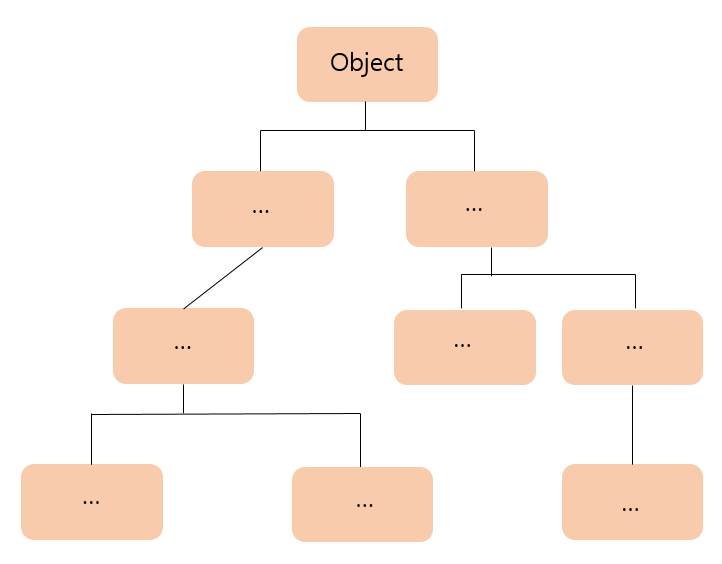
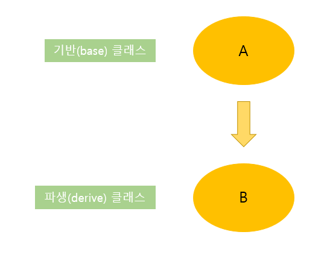

# 20191217

## Chapter06. 클래스 상속

### 상속이란

상속: 객체지향 프로그래밍에서 코드의 재사용성과 간결성을 제공하는 중요한 특징
- 상속개념 이용하여 기반 클래스 바탕으로 새로운 기능 추가 -> 파생 클래스 만듦
- 코드의 재활용 통해 빠른 속도로 프로그램 개발 가능
- 프로그램의 재사용성을 증대시키는 C#의 중요한 특징
- 기존 클래스: 기반 클래스(Base class), 또는 부모 클래스(Parent Class)라고 부름
- 파생 클래스: 기반 클래스를 확장하여 새롭게 정의한 클래스
    - 파생 클래스(Derive Class) 또는 자식 클래스(Child Class)라고 부름
- 파생 클래스는 기반 클래스의 public, protected 속성 및 기능을 모두 물려받음
- 상속: 파생 클래스가 기반 클래스의 속성 및 기능을 물려받아 재사용하는 것


- 기반 클래스에서 정의된 속성을 상속받은 클래스에서 사용 가능함.
- 기반 클래스의 속성을 파생 클래스에서 사용 시 public, protected 등의 접근 제한자가 사용됨
- 닷넷 프레임워크는 Object 클래스를 최상위 클래스로 정해놓음
- 많은 클래스가 이 클래스를 상속받는 계층 구조로 이루어짐



#### 상속구현
- 상속은 파생 클래스 이름 뒤에 ':'을 사용, 기반 클래스 이름을 기술해 구현함.
```C##
[public/ abstract/ sealed]class [파생 클래스이름]:[기반 클래스이름]
{
    //멤버
}
```
- 상속 관계에서 파생 클래스는 기반 클래스의 public, protected, internal, protected internal 접근 제한자를 갖는 모든 멤버들을 상속받음.


```C#
public class B : A
{
    ...
}
```
### 상속과 접근 한정자
- 상속 관계에 있는 파생 클래스는 기반 클래스의 public, protected, internal, protected internal 접근 한정자를 갖는 멤버에 접근 가능함.
- private 접근 한정자를 갖는 멤버들: 클래스 내부에서만 사용됨
- public 멤버들: 클래스 외부에서 사용 가능
- protected 멤버: 상속 관계에서는 public 처럼, 아닐 때는 private 처럼 사용됨

```C#
    class Father
    {
        protected string family_name = "김";
        private string name = "아무개1"; //Son 클래스에서는 참조 불가능
        private int age = 39; //Son 클래스에서는 참조 불가능
    }
    class Son: Father
    {
        private string name = "아무개2";
        private int age = 10;
        public void Info()
        {
            Console.WriteLine("이름은 {0} {1} 입니다.", family_name, name);
            Console.WriteLine("나이는 {0} 살 입니다.", age);
        }
    }

    class InheritanceExam1
    {
        static void Main(string[] args)
        {
            Son obj = new Son();
            obj.Info();
        }
    }
```

```C#
class A
    {
        public A()
        {
            Console.WriteLine("A클래스 생성자");
        }
        ~A()
        {
            Console.WriteLine("A클래스 소멸자");
        }
    }
    class B:A
    {
        public B()
        {
            Console.WriteLine("B클래스 생성자");
        }
        ~B()
        {
            Console.WriteLine("B클래스 소멸자");
        }

    }
    class C: B
    {
        public C()
        {
            Console.WriteLine("C클래스 생성자");
        }
        ~C()
        {
            Console.WriteLine("C클래스 소멸자");
        }
    }
    class InheritanceExam2
    {
        static void Main(string[] args)
        {
            C obj = new C();
        }
    }
```
[실행결과]
A클래스 생성자
B클래스 생성자
C클래스 생성자
C클래스 소멸자
B클래스 소멸자
A클래스 소멸자
- 클래스의 생성자와 소멸자도 상속됨
- 생성자는 메모리에 값이 초기화될 때 실행됨
- 소멸자는 메모리에서 객체가 제거되기 직전에 호출됨
- 생성자는 안쪽부터, 소멸자는 바깥쪽부터 실행됨
- A>>B>>C

### 오버라이드와 base 키워드
- 상속관계에서 파생 클래스는 기반 클래스의 멤버에 대해 오버라이드할 수 있음.
- new 키워드를 사용해 구현, new의 기능: 인스턴스를 생성할 때의 기능과는 다름

```c#
[접근제한자]new [반환형][메소드 이름]([매개변수]...)
[접근제한자]new [자료형][변수명]
```
- `new`: 부모 클래스에서 상속받은 멤버에 대해 파생 클래스에서는 새로운 용도로 활용하겠다고 컴파일러에 알려주는 기능 수행
- 부모 클래스에서 물려받은 멤버에 대해 new를 사용해 새롭게 정의 
    -> 부모가 갖는 멤버와는 별개로 자신만의 멤버로 사용됨

[멤버 오버라이드]
```C#
 class Base
    {
        public int x = 10;
        public void SetData(int data)
        {
            this.x = data;
        }
    }
    class Derived :Base
    {
        public new int x = 100;
        public new void SetData(int data)
        {
            this.x = data * 2;
        }
    }
    class newExam
    {
        
        static void Main(string[] args)
        {
            Derived obj = new Derived();
            Console.WriteLine("Derived.x = {0}", obj.x);
            obj.SetData(10);
            Console.WriteLine("SetData => Derived.x = {0}", obj.x);
        }
    }
```
[실행결과]
Derived.x = 100
SetData => Derived.x = 20

- base는 파생 클래스에서 오버라이드한 기반 클래스의 멤버에 접근할 떄 사용하는 키워드
- base.[변수명], base.[메서드명] 형태로 파생 클래스에서 오버라이드된 기반 클래스의 public 또는 protected 요소에 접근 가능함.

```C#
class Base
    {
        public int x = 10;
        public void SetData(int data)
        {
            this.x = data;
        }
    }
    class Derived: Base
    {
        public new int x = 100;
        public new void SetData(int data)
        {
            Console.WriteLine("before Base::x = {0}", base.x);
            Console.WriteLine("before Deried::x = {0}", this.x);
            base.SetData(200);
            this.x = base.x + this.x + data; // 10+100+data
            Console.WriteLine("after Base::x = {0}", base.x);
            Console.WriteLine("after Derived::x = {0}", this.x);       
        }

    }
    class baseExam1
    {
        static void Main(string[] args)
        {
            Derived obj = new Derived();
            Console.WriteLine("Derived.x = {0}", obj.x);
            obj.SetData(10);
            Console.WriteLine("SetData => Derived.x = {0}", obj.x);
        }
    }
```
- base 키워드 사용 시 기반 클래스의 변수와 메서드 이외의 생성자에도 접근이 가능함.
- 기반 클래스의 생성자에 접근할 떄는 파생 클래스의 생성자 선언 뒷부분에 ':' 사용해서 기반 클래스의 생성자를 호출하도록 코드 작성

```C#
class Derived:Base
{
    public Derived():base()
    {
        ...
    }
}
```

- base()는 Derived 클래스가 상속받은 기반 클래스 Base 클래스의 인자없는 생성자를 가리킴
- 상속 관계에서 생성자는 위쪽부터 호출됨.

`public Derived() : base()` 
- 상위 클래스의 생성자 실행 -> Derived 클래스의 생성자를 실행

[실행결과]
Base::Base() 생성자
Derived::Derived() 생성자
data = 100
Base::Base(int data) 생성자
Derived::Derived(int data) 생성자
data = 200

### 추상 클래스와 추상 메서드
- 추상화: 객체지향 언어의 중요한 개념 중 하나
    - 사물의 공통된 특징을 뽑아내는 것을 말함
- C#은 추상화를 클래스와 메서드로 표현함
- 추상화 클래스는 추상 메서드를 한 개 이상 포함하고 있음.
- 메서드의 원형만 정의된 독특한 메서드로 abstract 키워드를 사용함, 추상화 클래스 내에서만 사용함
- 추상화 클래스는 직접 사용 불가능, 반드시 다른 클래스에서 상속되어 추상 메서드를 오버라이드해야 함.
- 추상 클래스와 추상 메서드는 파생 클래스에 클래스 구현 요소에 대한 청사진을 제공함-> 클래스 설계도면과 같은 역할함
- 파생 클래스에서 추상 메서드를 오버라이딩 시에는, `new`키워드가 아니라 `override`키워드를 사용해야 함.

```C#
abstract class Car
{
    public abstract void Engine();
}

class Taxi:Car
{
    public override void Engine(){
        //Engine 메서드 구현...
    }
}
```
### virtual 키워드와 가상 메서드
- 가상 메서드는 추상 메서드와 비슷함
- 추상 메서드: 추상 클래스 내에서만 선언되고 사용됨
              메서드의 원형만 선언, 실제 구현은 파생 클래스에서 함
    vs
- 가상 메서드: `virtual` 키워드를 사용해 선언, `virtual` 키워드를 붙인 것만 빼면 일반 메서드와 동일함.
              메서드 원형뿐만 아니라 구현도 선언과 동시에 함
              보통의 메서드가 파생 클래스에서 재정의될 수 있도록 준비되어 있는 메서드
```C#
class Car
{
    public virtual void Engine(){
        System.Console.WriteLine("엔진 구현");
    }
}

class Taxi: Car
{
    public override void Engine(){
        System.Console.WriteLine("엔진 중복 구현");
    }
}
```              
- virtual 키워드는 파생 클래스에서 오버라이드될 가능성이 큰 메서드 앞에 사용함
- 가상 메서드를 사용하는 이유는?
    - CLR은 기반 클래스에 정의된 메서드 중 파생 클래스에서 오버라이드한 메서드를 호출 시, 어떤 메서드를 실행할 지 검사하는 작업 수행
    - 오버라이드한 메서드를 실행할지, 기반 클래스에 정의된 메서드를 실행할지 선택하는 작업은 복잡함 -> 프로그램 수행 속도에 영향 미침
    - virtual 키워드가 붙은 가상 메서드는 CLR의 vtable 테이블(메서드 주소를 저장하는 CLR 장치) 내부에 저장됨
    - 가상 메서드는 vtable에서 메서드의 주소를 검색해서 일반 메서드보다 빠르게 실행됨

### override 사용하기
- new 키워드: 부모 클래스의 멤버를 숨김
- override 키워드: 부모 클래스의 메서드와 속성을 완전히 새롭게 정의함
                  abstract나 virtual이 선언된 메서드 또는 이미 부모클래스에서 override 키워드를 이용해서 재정의된 메서드를 다시 정의할 때 사용함.

```C#
    abstract class Parent
    {
        public abstract void Show();
    }
    class Child: Parent
    {
        public override void Show()
        {
            Console.WriteLine("Show 메서드 override");
        }
    }
    class overrideExam1
    {
        static void Main(string[] args)
        {
            Parent obj = new Child();
            obj.Show();
        }
    }
```
[실행결과]
Show 메서드 override

```C#
  class Parent
    {
        public virtual void Show()
        {
            Console.WriteLine("부모 클래스::Show");
        }
    }
    class Child : Parent
    {
        public override void Show()
        {
            Console.WriteLine("자식 클래스::Show");
        }
    }
    class overrideExam2
    {
        static void Main(string[] args)
        {
            Parent obj = new Parent();
            obj.Show();
            obj = new Child();
            obj.Show();
        }
    }
```
[실행결과]
부모 클래스::Show
자식 클래스::Show

### sealed 클래스와 sealed 메서드
- sealed 클래스와 sealed 메서드는 추상 클래스나 추상 메서드와 반대 개념
- 추상 메서드: 파생 클래스에서 반드시 오버라이드해야 함
    - sealed(봉인): 파생 클래스에서 사용할 수 없다는 의미를 가짐
    - 다른 클래스가 이 클래스를 더 이상 상속받지 못하도록 막을 때 사용함.
    - 보안 사항이나 코드 설계 부분의 뜻을 명확하게 하기 위해 사용됨
    - 상업적인 코드를 작성할 떄나 내부 구현이 복잡해서 파생 클래스에서 오버라이드할 경우 문제가 발생할 가능성이 있는 코드 작성을
      사전에 차단하는 용도로 사용됨
    - sealed 클래스를 상속받아서 새로운 클래스를 정의하려고 한다면 컴파일러는 오류 메세지를 발생시킴
    ```C#
     sealed class Base{
         ...
     }
     class Derived:Base{
         ...
     }
    ```
    - Base 클래스가 sealed 처리되어있는 상태에서 Derived 클래스 정의 시, "Derived": sealed 형식 'Base'에서 파생할 수 없습니다. 라는 컴파일 오류가 출력됨.
    - 클래스에 정의된 메서드에 sealed를 사용 시, 해당 메서드는 파생 클래스에서 오버라이드 불가능
    ```C#
       class Original
    {
        public virtual void FinalMethod()
        {
            Console.WriteLine("원본 FinalMethod");
        }

    }
    class Base: Original
    {
        //여기서 봉인하겠다... 더 이상 이 메서드는 상속 못 받음
        public sealed override void FinalMethod()
        {
            Console.WriteLine("Sealed 메서드입니다.");
        }

    }
    class Derived:Base
    {
        public override void FinalMethod()
        {
            // ..//sealed 메서드를 오버라이드하면 컴파일 에러 발생
        }
    }
    ```

### 인터페이스
- 인터페이스: 기본적으로 단일 상속만 지원하는 C#에서 다중 상속을 구현하기 위한 방법을 제공함
    - 이름뿐인 메서드, 델리게이트, 이벤트, 속성만 선언 가능함.
    - 인터페이스에 선언된 메서드는 상속받은 클래스에서 실제 내용을 구현함.

#### 인터페이스 형식
```C#
interface 인터페이스명[:인터페이스명,...]
{
    //이름뿐인 메서드, 델리게이트, 이벤트 선언
}
```

```C#
interface Speed
{
    void SpeedUp(int inc);
    void SpeedDown(int inc);
}
```

- 인터페이스는 실제 객체가 갖고 있어야 하는 기능 자체를 구현하지 않음.
- 어떤 기능을 수행해야 되는지에 관해서만 명시함.
- 실제 기능: 인터페이스를 상속받은 클래스에서 구현해야 함.

```C#
    interface 새
    {
        void fly();
    }
    interface 말
    {
        void run();
    }
    class 페가수스:새, 말
    {
        public void fly() { Console.WriteLine(" 하늘을 난다! "); }
        public void run() { Console.WriteLine(" 대륙을 달린다! "); }
    }
    class InterfaceExam1
    {
        static void Main(string[] args)
        {
            페가수스 pega = new 페가수스();
            pega.fly();
            pega.run();
        }
    }
```

#### 인터페이스 간의 상속 관계
- 인터페이스도 클래스와 마찬가지로 상속이 가능함.
- 인터페이스간의 상속도 클래스와 마찬가지로 ';' 사용함.
- 인터페이스간의 상속은 다중 상속이 가능함.
- 각각의 인터페이스는 , 로 구분함.

```C#
    interface 자동차
    {
        void run();
    }
    interface 배
    {
        void navigation();
    }
    interface 수륙양용자동차: 자동차, 배
    {
        void floating();
    }
    class NewCar: 수륙양용자동차
    {
        
        public void run(){ Console.WriteLine("육지를 달리는 능력"); }
        public void navigation() { Console.WriteLine("바다를 항해하는 능력"); }
        public void floating() { Console.WriteLine("공중에 떠있는 가방"); }
        
    }
    class InterfaceExam2
    {
        static void Main(string[] args)
        {
            NewCar car = new NewCar();
            car.run();
            car.navigation();
            car.floating();
        }
    }
```
- 만약 상속받은 메서드를 오버라이딩 안 하면 컴파일 에러 발생함

```C#
  interface MyInterface
    {
        void Display();
    }
    class MyClass
    {
        public void Show()
        {
            Console.WriteLine("MyClass::Show()");
        }
    }
    class ObjectClass : MyClass, MyInterface
    {
        public void Display() { Console.WriteLine("MyInterface::Display()"); }
    }
    class InterfaceExam3
    {
        static void Main(string[] args)
        {
            ObjectClass obj = new ObjectClass();
            obj.Show();
            MyInterface inter = (MyInterface)obj;
            inter.Display();
        }
    }
```
- 상속 관계에 있는 인터페이스는 클래스 상속처럼 형 변환이 가능함.
- 하나의 인터페이스를 상속받은 여러 클래스가 있다면 각각의 클래스 내용(Body)는 다르지만 
  하나의 인터페이스를 상속 받았음 -> 인터페이스에 정의된 메서드를 모든 클래스가 공유하게 됨
  인터페이스의 형 변환과 반복문 이용 -> 동일한 인터페이스를 상속받은 여러 클래스를 동시에 호출 가능함.
  
```C#
interface MyInterface
    {
        void Show();
    }
    class A :MyInterface
    {
        public void Show()
        {
            Console.WriteLine("A-Class::Show()");
        }
    }
    class B :MyInterface
    {
        public void Show()
        {
            Console.WriteLine("B-Class::Show()");
        }

    }
    class C: MyInterface
    {
        public void Show()
        {
            Console.WriteLine("C-Class::Show()");
        }
    }

    class InterfaceExam4
    {
        static void Main(string[] args)
        {
            A a = new A();
            B b = new B();
            C c = new C();

            MyInterface[] inter = new MyInterface[3];
            inter[0] = (MyInterface)a;
            inter[1] = (MyInterface)b;
            inter[2] = (MyInterface)c;

            for(int i = 0; i < inter.Length; i++)
            {
                inter[i].Show();
            }
        }
    }
```
[실행결과]
```C#
A-Class::Show()
B-Class::Show()
C-Class::Show()
```